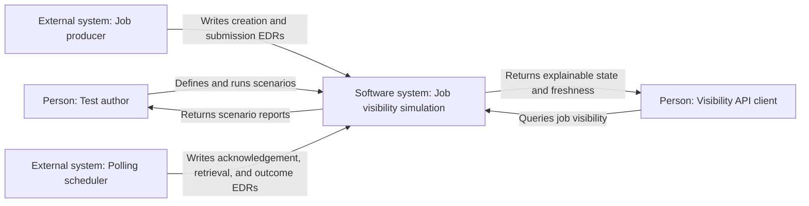
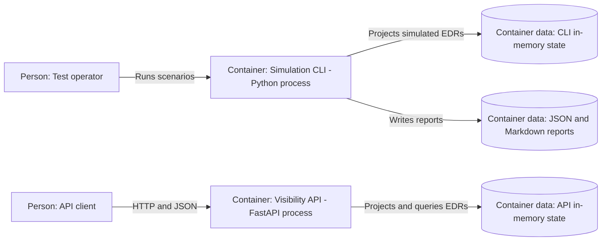
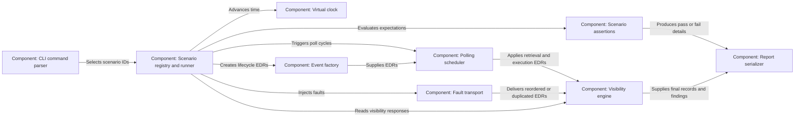
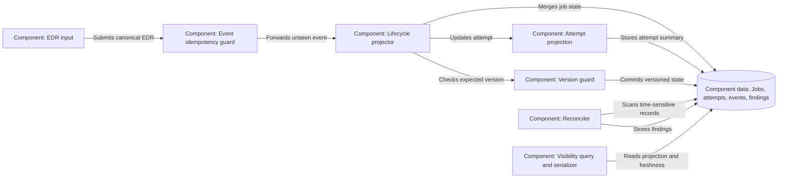
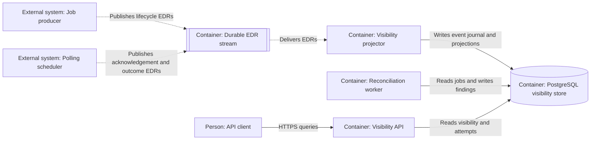
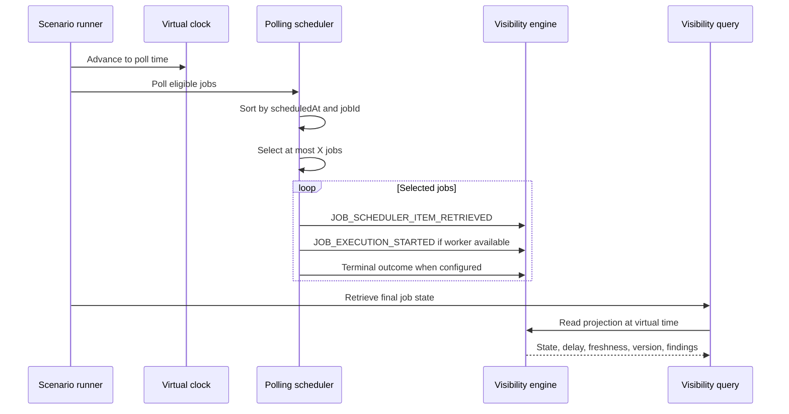
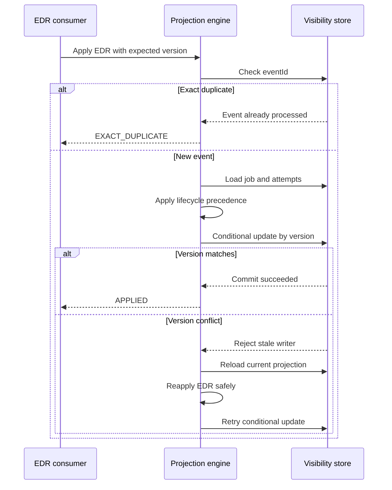
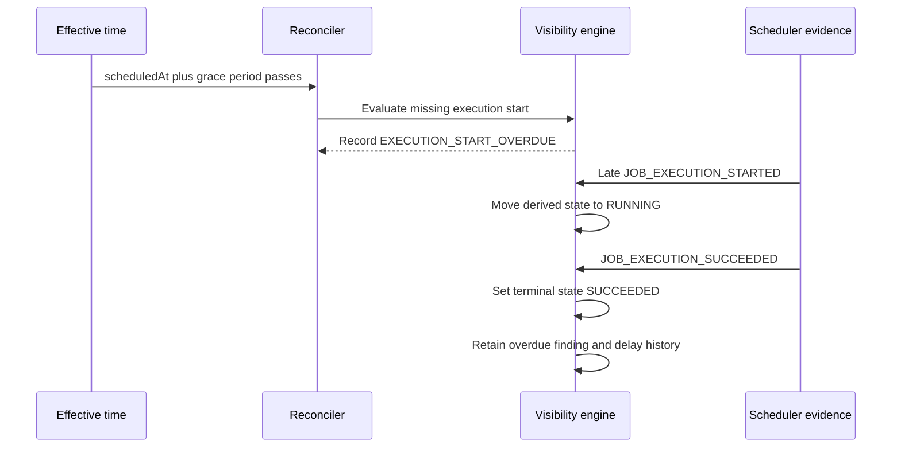
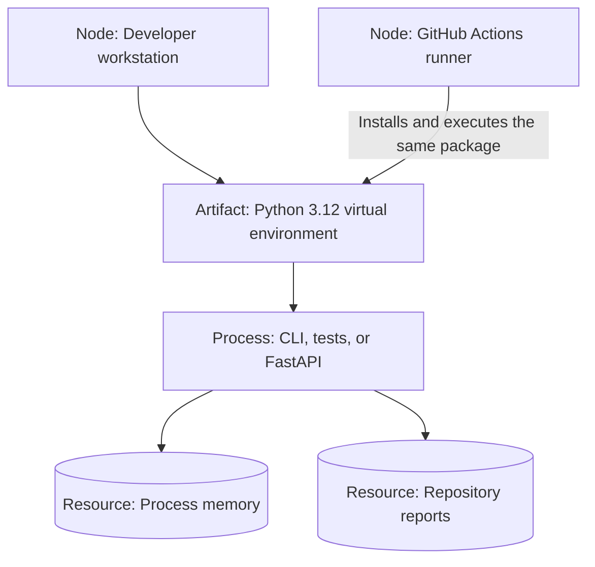
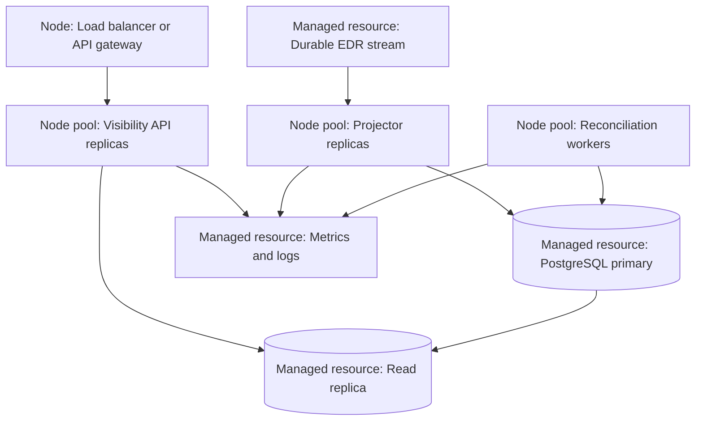

# Scheduled Job Visibility Simulation Architecture

Status: current implementation plus production target
Last updated: 2026-07-22

This document uses the arc42 structure for architectural concerns and C4-style views for
system context, containers, components, and deployment. It distinguishes implemented
behavior from the production architecture proposed in
[`plan.md`](specs/001-scheduled-job-visibility/plan.md).

## 1. Introduction and goals

### 1.1 Purpose

The system validates whether a visibility API gives an accurate and explainable view of
jobs handled by an external polling scheduler. The modeled scheduler polls once per minute,
retrieves at most `X` eligible jobs, and may start fewer jobs than it retrieves because of
worker capacity.

The implementation is both:

- A deterministic simulator for happy-path, failure, ordering, concurrency, and polling
  scenarios.
- A reference visibility projection that consumes lifecycle EDRs and exposes business
  state through an HTTP API.

### 1.2 Architectural goals

| Priority | Goal | Architectural response |
| ---: | --- | --- |
| 1 | Evidence accuracy | Submission intent, scheduler acknowledgement, retrieval, execution, and retry acknowledgement remain separate facts. |
| 2 | Explainable lateness | The projection separates normal poll-window delay, possible backlog, retrieved-but-waiting delay, overdue execution, and stale data. |
| 3 | Deterministic validation | A virtual clock and declarative scenarios avoid wall-clock sleeps and nondeterministic tests. |
| 4 | Idempotency | Exact event IDs and semantic attempt outcomes are deduplicated. |
| 5 | Safe ordering | Late events may backfill evidence but cannot incorrectly regress terminal state. |
| 6 | Concurrency safety | Version checks reject stale writers; the target persistence layer uses transactional conditional updates. |
| 7 | Operational visibility | API responses expose `dataAsOf`, processing delay, version, findings, and lifecycle-quality flags. |

### 1.3 Stakeholders

| Stakeholder | Concern |
| --- | --- |
| Operations | Why did a job not run at its intended time? |
| Application teams | Was the job submitted, accepted, retrieved, started, or completed? |
| Support teams | Can a job state be explained from retained evidence? |
| Platform engineers | Does batching protect the scheduler without losing or duplicating jobs? |
| Test engineers | Can failures, delays, duplicates, and reordering be reproduced deterministically? |
| API clients | Is the response current, complete, and safe to act upon? |

## 2. Architecture constraints

### 2.1 Business and integration constraints

- The external scheduler is outside the visibility system's control.
- The scheduler polls once every 60 seconds.
- Each poll retrieves at most `X` eligible jobs.
- EDRs are the authoritative integration evidence.
- Missing evidence must not be replaced with an assertion about scheduler state.
- Retry request and retry acknowledgement must remain distinguishable.
- The intended execution time is not guaranteed when polling backlog exceeds capacity.

### 2.2 Technical constraints

- Python 3.12 or newer.
- FastAPI and Pydantic provide the implemented HTTP boundary.
- Tests must use virtual time rather than real sleeps.
- The current implementation is in-memory and single-process.
- PostgreSQL, durable EDR transport, and independently scalable services are target-state
  elements and are not yet implemented.

### 2.3 Conventions

- All timestamps represent timezone-aware UTC instants.
- Raw EDR fields use lifecycle terminology; API responses use business terminology.
- `recordedStatus` reflects processed evidence.
- `status` may additionally apply time-derived rules such as `AWAITING_EXECUTION` or
  `OVERDUE`.

## 3. Context and scope

### 3.1 C4 level 1 — system context

The external systems in this view are simulated by Python components during scenario runs.
In a production deployment, the actual producer and scheduler remain outside the system
boundary.

### 3.2 External interfaces

| Interface | Direction | Purpose |
| --- | --- | --- |
| Lifecycle EDR | Inbound | Record observable job facts. |
| `POST /edrs` | Inbound | Submit one canonical EDR to the current in-memory projector. |
| `GET /scheduled-jobs/{jobId}` | Outbound | Retrieve one business-oriented visibility record. |
| `GET /scheduled-jobs/{jobId}/attempts` | Outbound | Retrieve observed attempt history. |
| `GET /scheduled-jobs` | Outbound | Search by status, correlation, and scheduled range. |
| `POST /reconciliation-runs` | Inbound | Run time-based consistency checks. |
| Simulation JSON/Markdown | Outbound | Preserve scenario inputs, decisions, assertions, and results. |

## 4. Solution strategy

The architecture uses an event-derived materialized view:

1. Treat every EDR as an observed fact with separate event and ingestion timestamps.
2. Deduplicate by `eventId` before applying lifecycle rules.
3. Deduplicate terminal attempt outcomes semantically by job and attempt number.
4. Project events into one job summary plus attempt summaries.
5. Preserve terminal outcomes while allowing late evidence to backfill missing timestamps.
6. Derive time-sensitive visibility at read and reconciliation time.
7. Make batching, polling cadence, worker capacity, and transport faults configurable.
8. Run all behavior against a virtual clock and emit assertion-rich reports.

The current implementation optimizes for behavioral correctness and repeatability. The
target architecture replaces process-local state with durable event and projection stores
so that API, projection, polling, and reconciliation can scale independently.

## 5. Building-block view

### 5.1 C4 level 2 — current containers and execution modes

The two entry points do not currently share state. Starting the API creates a new
`VisibilityEngine`; running the CLI creates independent engines per scenario. This is
intentional for simulation isolation but is a production limitation.

### 5.2 C4 level 3 — simulation CLI components

### 5.3 C4 level 3 — visibility engine components

### 5.4 C4 level 2 — production target containers

The durable stream is intentionally technology-neutral. Selecting Kafka, a managed queue,
or a database-backed inbox requires delivery, ordering, retention, and operations data that
the current repository does not provide.

## 6. Runtime view

### 6.1 Polling, batch selection, and execution

Overflow jobs remain eligible and are considered by the next poll. Retrieval and execution
are distinct because a worker may not be available after the scheduler claims a job.

### 6.2 Idempotent projection with optimistic concurrency

The current engine performs this behavior under a process-local reentrant lock. The target
store performs the conditional update transactionally in PostgreSQL.

### 6.3 Late evidence repairs an overdue job

## 7. Deployment view

### 7.1 Current local and CI deployment

Properties:

- No external service is required for the simulation suite.
- Process exit discards projected state.
- The CLI writes reports to `simulation-results/`.
- CI executes formatting, linting, tests, and the minimum simulation set.

### 7.2 Production target deployment

The read replica is optional. If used, API freshness must expose replica delay rather than
claiming strong consistency.

## 8. Cross-cutting concepts

### 8.1 Evidence and state semantics

- Scheduler submission request expresses intent only.
- Scheduler submission acknowledgement proves acceptance only.
- Retrieval evidence proves selection by a poll only.
- Execution start proves runtime activity only.
- Terminal outcome EDRs determine the operational result.
- Absence of evidence is reported as pending, unknown, incomplete, stale, or overdue.

### 8.2 Time

- `eventTime` describes when the source says the fact occurred.
- `ingestionTime` describes when visibility received the fact.
- `dataAsOf` describes the projection's freshness boundary.
- Time-derived status uses an injected effective time.
- Processing delay is `ingestionTime - eventTime` and never changes lifecycle ordering by
  itself.

### 8.3 Idempotency and ordering

- Exact duplicates are identified by `eventId`.
- Semantic execution duplicates are identified by job, attempt, and outcome.
- Terminal precedence prevents late non-terminal events from erasing outcomes.
- Late start or retrieval evidence may backfill timestamps.
- Conflicting terminal outcomes are preserved in audit findings.

### 8.4 Concurrency

- The current engine serializes updates with `RLock` and supports expected-version checks.
- The target store uses a unique event key, a job version, and conditional updates.
- Target pollers claim eligible work with `FOR UPDATE SKIP LOCKED` or equivalent atomic
  leasing.

### 8.5 Observability

Every job response should expose:

- Recorded and derived status.
- Version and `dataAsOf`.
- Processing and scheduling delays.
- Attempt and retry summaries.
- Lifecycle completeness flags.
- Active and historical reconciliation findings.

Target operational metrics include eligible queue depth, oldest eligible job age, retrieved
batch size, batch saturation, poll duration, skipped polls, claim conflicts, worker wait,
execution delay, EDR processing delay, and projection retries.

### 8.6 Security and privacy

The current API has no authentication or authorization and must be treated as a local
simulation interface. A production deployment requires:

- Authenticated EDR ingestion and client access.
- Authorization by job type, tenant, or correlation scope.
- TLS in transit and encryption at rest.
- Redaction of error messages and payload references.
- Audit retention and deletion policies.
- Rate limits on ingestion, search, and reconciliation operations.

## 9. Architectural decisions

| Decision | Status | Rationale | Consequence |
| --- | --- | --- | --- |
| Use immutable lifecycle EDRs as facts | Accepted | Facts remain auditable and can rebuild visibility. | Projection rules must handle duplicates and reordering. |
| Separate acknowledgement, retrieval, and execution | Accepted | Each boundary answers a different operational question. | More event types and incomplete-lifecycle cases exist. |
| Use a virtual clock in simulations | Accepted | Timeouts and minute polling become fast and deterministic. | Production wall-clock behavior still requires integration testing. |
| Bound retrieval by configurable `X` | Accepted | Matches the company scheduler and prevents unbounded poll work. | Hotspots create measurable backlog. |
| Keep `recordedStatus` separate from `status` | Accepted | Time-derived conclusions do not overwrite evidence. | Clients must understand both fields. |
| Start with an in-memory engine | Accepted for simulation | Minimizes infrastructure and validates domain rules first. | State is ephemeral and cannot scale across processes. |
| Use PostgreSQL for the target visibility store | Proposed | Transactions, unique constraints, indexes, and conditional updates fit the model. | Adds operating cost and migration work. |
| Keep the durable EDR transport technology-neutral | Open | Delivery and scale requirements are not yet measured. | Production container design is incomplete until selected. |

## 10. Quality requirements

| Quality | Scenario | Required response |
| --- | --- | --- |
| Precision | Job becomes eligible just after a poll. | Do not mark it overdue during the expected polling interval. |
| Scalability | More than `X` jobs become eligible together. | Retrieve at most `X` per poll and retain overflow without loss. |
| Hotspot resilience | Multiple batches become eligible simultaneously. | Drain deterministically without duplicate claims or starvation. |
| Reliability | Start EDR is missing but success arrives. | Return `SUCCEEDED`, keep `startedAt=null`, and mark lifecycle incomplete. |
| Idempotency | The same event ID arrives twice. | Apply once and do not increment the version twice. |
| Ordering | Start arrives after success. | Backfill time without regressing `SUCCEEDED`. |
| Concurrency | Two writers use the same expected version. | Reject one writer and safely reapply after reload. |
| Freshness | API reads delayed projection data. | Expose `dataAsOf` and stale status. |
| Explainability | Job exceeds its execution grace period. | Return `OVERDUE` while preserving `recordedStatus=SCHEDULED`. |
| Cost | CI runs the core simulation. | Require no external runtime service for behavioral validation. |

The executable evidence for these requirements is summarized in
[`simulation-results/summary.md`](simulation-results/summary.md).

## 11. Risks and technical debt

| Risk | Impact | Mitigation or next step |
| --- | --- | --- |
| In-memory state | Data loss and no horizontal scaling. | Implement PostgreSQL repositories and migrations. |
| CLI and API use separate engines | API cannot inspect a completed CLI run. | Share a durable store or import a saved run explicitly. |
| Linear scan and sort per poll | Poor open-task scalability. | Query an indexed eligibility table with bounded claims. |
| Single process lock | Hotspot bottleneck. | Use database transactions, sharding, and multiple consumers. |
| No authenticated API | Unsafe outside local development. | Add identity, authorization, TLS, and rate limiting. |
| Technology-neutral EDR stream | Delivery guarantees remain undefined. | Benchmark and select transport based on volume and ordering needs. |
| No production load test | Architecture scores remain estimates. | Add backlog, throughput, latency, and concurrency benchmarks. |
| Report files are snapshots | Results can become stale after code changes. | Regenerate them in CI and record the source commit in each report. |
| Poll interval limits precision | Jobs may start up to one minute late before backlog. | Shorten polling or adopt event/timer wake-up for tighter SLAs. |

## 12. Glossary

| Term | Meaning |
| --- | --- |
| EDR | Event data record containing one observed lifecycle fact. |
| `X` | Maximum number of eligible jobs retrieved by one scheduler poll. |
| Recorded status | State directly supported by accepted lifecycle evidence. |
| Derived status | Business state after time-based rules are evaluated. |
| Retrieval | Scheduler selection of an eligible job during a poll. |
| Attempt | One observed execution of a job. |
| Reconciliation finding | Auditable detection of missing, delayed, conflicting, or inconsistent evidence. |
| `dataAsOf` | Latest ingestion time reflected in the projection. |
| Hotspot | A concentrated arrival of eligible work that exceeds immediate batch or worker capacity. |
