# Scheduled Job Scheduling and Visibility Architecture

Status: current implementation through Spec 004
Last updated: 2026-08-21

This document uses the arc42 structure for architectural concerns and C4-style views for
system context, containers, components, and deployment. It covers the deterministic
simulation and the durable production-like runtime delivered by Specs 002–004.

## 1. Introduction and goals

### 1.1 Purpose

The system validates whether a visibility API gives an accurate and explainable view of
jobs handled by an external polling scheduler. The modeled scheduler polls once per minute,
retrieves at most `X` eligible jobs, and may start fewer jobs than it retrieves because of
worker capacity.

The implementation is both:

- A deterministic simulator for happy-path, failure, ordering, concurrency, and polling
  scenarios.
- A reference visibility projection that consumes lifecycle EDRs and exposes business
  state through an HTTP API.
- A durable scheduler, worker, event-delivery pipeline, and role-isolated production HTTP
  topology backed by PostgreSQL, Kafka, Kafka Connect, and optional Cassandra handlers.

### 1.2 Architectural goals

| Priority | Goal | Architectural response |
| ---: | --- | --- |
| 1 | Evidence accuracy | Submission intent, scheduler acknowledgement, retrieval, execution, and retry acknowledgement remain separate facts. |
| 2 | Explainable lateness | The projection separates normal poll-window delay, possible backlog, retrieved-but-waiting delay, overdue execution, and stale data. |
| 3 | Deterministic validation | A virtual clock and declarative scenarios avoid wall-clock sleeps and nondeterministic tests. |
| 4 | Idempotency | Exact event IDs and semantic attempt outcomes are deduplicated. |
| 5 | Safe ordering | Late events may backfill evidence but cannot incorrectly regress terminal state. |
| 6 | Concurrency safety | Version checks reject stale writers; durable stores use transactional and conditional updates. |
| 7 | Operational visibility | API responses expose `dataAsOf`, processing delay, version, findings, and lifecycle-quality flags. |

### 1.3 Stakeholders

| Stakeholder | Concern |
| --- | --- |
| Operations | Why did a job not run at its intended time? |
| Application teams | Was the job submitted, accepted, retrieved, started, or completed? |
| Support teams | Can a job state be explained from retained evidence? |
| Platform engineers | Does batching protect the scheduler without losing or duplicating jobs? |
| Test engineers | Can failures, delays, duplicates, and reordering be reproduced deterministically? |
| API clients | Is the response current, complete, and safe to act upon? |

## 2. Architecture constraints

### 2.1 Business and integration constraints

- The deterministic simulator models an external scheduler; the durable runtime includes a
  bounded polling scheduler worker.
- Poll cadence is configurable and finite; simulation scenarios commonly use 60 seconds.
- Each poll retrieves at most `X` eligible jobs.
- EDRs are the authoritative integration evidence.
- Missing evidence must not be replaced with an assertion about scheduler state.
- Retry request and retry acknowledgement must remain distinguishable.
- The intended execution time is not guaranteed when polling backlog exceeds capacity.

### 2.2 Technical constraints

- Python 3.12 or newer.
- FastAPI and Pydantic provide the implemented HTTP boundary.
- Simulation tests use virtual time. Infrastructure and recovery tests use bounded
  condition polling against real services.
- The simulation remains in-memory and isolated by process.
- The durable runtime uses separate scheduler and EDR PostgreSQL authorities, Kafka with
  Schema Registry, Kafka Connect, and independently runnable API/worker roles.
- Production scheduler and visibility APIs must not receive each other's database
  credentials.

### 2.3 Conventions

- All timestamps represent timezone-aware UTC instants.
- Raw EDR fields use lifecycle terminology; API responses use business terminology.
- `recordedStatus` reflects processed evidence.
- `status` may additionally apply time-derived rules such as `AWAITING_EXECUTION` or
  `OVERDUE`.

## 3. Context and scope

### 3.1 C4 level 1 — system context

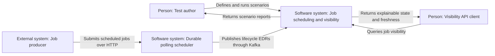
```mermaid
flowchart LR
    testAuthor["Person: Test author"]
    apiClient["Person: Visibility API client"]
    jobProducer["External system: Job producer"]
    scheduler["Software system: Durable polling scheduler"]
    visibility["Software system: Job scheduling and visibility"]

    testAuthor -->|"Defines and runs scenarios"| visibility
    apiClient -->|"Queries job visibility"| visibility
    jobProducer -->|"Submits scheduled jobs over HTTP"| scheduler
    scheduler -->|"Publishes lifecycle EDRs through Kafka"| visibility
    visibility -->|"Returns explainable state and freshness"| apiClient
    visibility -->|"Returns scenario reports"| testAuthor
```

During deterministic scenario runs, the producer, scheduler, transport, and visibility
engine are simulated in one process. In the durable topology they are separate roles joined
only through the scheduler database, transactional outbox, Kafka, and EDR database.

### 3.2 External interfaces

| Interface | Direction | Purpose |
| --- | --- | --- |
| `POST /scheduler/jobs` | Inbound | Durably create an idempotent scheduled job. |
| Lifecycle EDR topic | Internal | Carry canonical facts from scheduler outbox to EDR journal. |
| `POST /edrs` | Inbound | Optional simulation or Kafka-backed external EDR ingress. |
| `GET /edr-lifecycle` | Outbound | Retrieve EDR type, lifecycle group, and requirement mappings. |
| `GET /scheduled-jobs/{jobId}` | Outbound | Retrieve one business-oriented visibility record. |
| `GET /scheduled-jobs/{jobId}/attempts` | Outbound | Retrieve observed attempt history. |
| `GET /scheduled-jobs` | Outbound | Search by status, correlation, and scheduled range. |
| `POST /reconciliation-runs` | Inbound | Run time-based consistency checks. |
| Simulation JSON/Markdown | Outbound | Preserve scenario inputs, decisions, assertions, and results. |
| `/health/live`, `/health/ready`, `/metrics` | Outbound | Report role lifecycle, dependency readiness, and telemetry. |

## 4. Solution strategy

The architecture uses an event-derived materialized view:

1. Treat every EDR as an observed fact with separate event and ingestion timestamps.
2. Deduplicate by `eventId` before applying lifecycle rules.
3. Deduplicate terminal attempt outcomes semantically by job and attempt number.
4. Project events into one job summary plus attempt summaries.
5. Preserve terminal outcomes while allowing late evidence to backfill missing timestamps.
6. Derive time-sensitive visibility at read and reconciliation time.
7. Make batching, polling cadence, worker capacity, and transport faults configurable.
8. Run all behavior against a virtual clock and emit assertion-rich reports.

The simulation optimizes for behavioral correctness and repeatability. The production-like
runtime implements the durable stores and independently runnable scheduler API, scheduler
worker, publisher, Connect sink, projector, and visibility API.

## 5. Building-block view

### 5.1 C4 level 2 — simulation execution mode

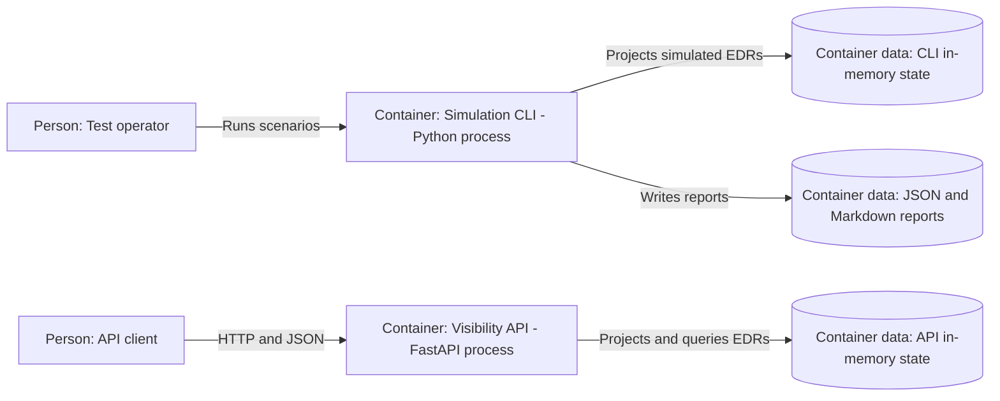
```mermaid
flowchart LR
    operator["Person: Test operator"]
    client["Person: API client"]

    cli["Container: Simulation CLI - Python process"]
    api["Container: Visibility API - FastAPI process"]
    cliMemory[("Container data: CLI in-memory state")]
    apiMemory[("Container data: API in-memory state")]
    reports[("Container data: JSON and Markdown reports")]

    operator -->|"Runs scenarios"| cli
    cli -->|"Projects simulated EDRs"| cliMemory
    cli -->|"Writes reports"| reports
    client -->|"HTTP and JSON"| api
    api -->|"Projects and queries EDRs"| apiMemory
```

The simulation entry points intentionally do not share state. Production commands use the
durable topology below instead of `job_visibility.api:app`.

### 5.2 C4 level 3 — simulation CLI components

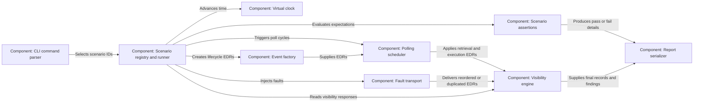
```mermaid
flowchart LR
    command["Component: CLI command parser"]
    runner["Component: Scenario registry and runner"]
    clock["Component: Virtual clock"]
    factory["Component: Event factory"]
    poller["Component: Polling scheduler"]
    transport["Component: Fault transport"]
    engine["Component: Visibility engine"]
    assertions["Component: Scenario assertions"]
    report["Component: Report serializer"]

    command -->|"Selects scenario IDs"| runner
    runner -->|"Advances time"| clock
    runner -->|"Creates lifecycle EDRs"| factory
    runner -->|"Triggers poll cycles"| poller
    runner -->|"Injects faults"| transport
    factory -->|"Supplies EDRs"| poller
    poller -->|"Applies retrieval and execution EDRs"| engine
    transport -->|"Delivers reordered or duplicated EDRs"| engine
    runner -->|"Reads visibility responses"| engine
    runner -->|"Evaluates expectations"| assertions
    assertions -->|"Produces pass or fail details"| report
    engine -->|"Supplies final records and findings"| report
```

### 5.3 C4 level 3 — visibility engine components

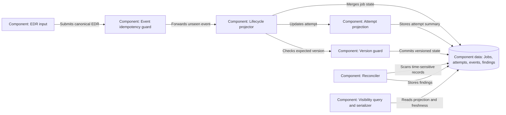
```mermaid
flowchart LR
    input["Component: EDR input"]
    idempotency["Component: Event idempotency guard"]
    projector["Component: Lifecycle projector"]
    attempts["Component: Attempt projection"]
    versioning["Component: Version guard"]
    reconciliation["Component: Reconciler"]
    query["Component: Visibility query and serializer"]
    state[("Component data: Jobs, attempts, events, findings")]

    input -->|"Submits canonical EDR"| idempotency
    idempotency -->|"Forwards unseen event"| projector
    projector -->|"Merges job state"| state
    projector -->|"Updates attempt"| attempts
    attempts -->|"Stores attempt summary"| state
    projector -->|"Checks expected version"| versioning
    versioning -->|"Commits versioned state"| state
    reconciliation -->|"Scans time-sensitive records"| state
    reconciliation -->|"Stores findings"| state
    query -->|"Reads projection and freshness"| state
```

### 5.4 C4 level 2 — durable production containers

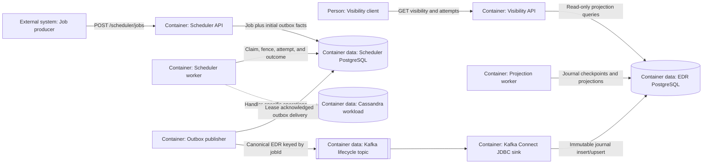
```mermaid
flowchart LR
    producer["External system: Job producer"]
    client["Person: Visibility client"]
    schedulerApi["Container: Scheduler API"]
    worker["Container: Scheduler worker"]
    schedulerDb[("Container data: Scheduler PostgreSQL")]
    publisher["Container: Outbox publisher"]
    kafka[["Container data: Kafka lifecycle topic"]]
    connect["Container: Kafka Connect JDBC sink"]
    edrDb[("Container data: EDR PostgreSQL")]
    projector["Container: Projection worker"]
    visibilityApi["Container: Visibility API"]
    cassandra[("Container data: Cassandra workload")]

    producer -->|"POST /scheduler/jobs"| schedulerApi
    schedulerApi -->|"Job plus initial outbox facts"| schedulerDb
    worker -->|"Claim, fence, attempt, and outcome"| schedulerDb
    worker -.->|"Handler-specific operations"| cassandra
    publisher -->|"Lease acknowledged outbox delivery"| schedulerDb
    publisher -->|"Canonical EDR keyed by jobId"| kafka
    kafka --> connect
    connect -->|"Immutable journal insert/upsert"| edrDb
    projector -->|"Journal checkpoints and projections"| edrDb
    client -->|"GET visibility and attempts"| visibilityApi
    visibilityApi -->|"Read-only projection queries"| edrDb
```

The scheduler API and worker never read EDR PostgreSQL. The visibility API never reads
scheduler PostgreSQL. Kafka Connect is the only raw-journal writer, and projection is
rebuildable from that journal.

## 6. Runtime view

### 6.1 Durable submission-to-visibility sequence

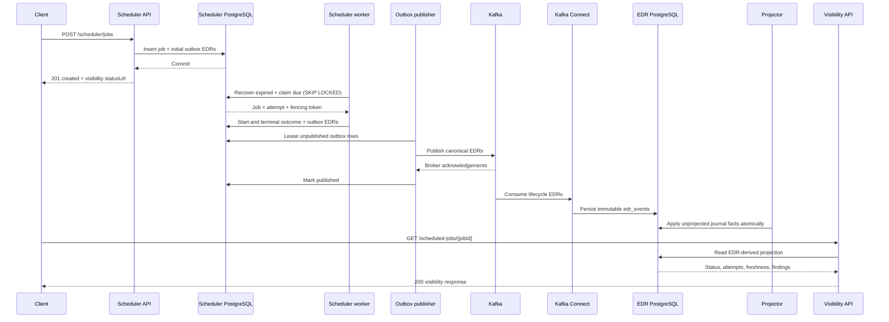
```mermaid
sequenceDiagram
    participant Client
    participant SchedulerAPI as Scheduler API
    participant SchedulerDB as Scheduler PostgreSQL
    participant Worker as Scheduler worker
    participant Publisher as Outbox publisher
    participant Kafka
    participant Connect as Kafka Connect
    participant EDRDB as EDR PostgreSQL
    participant Projector
    participant VisibilityAPI as Visibility API

    Client->>SchedulerAPI: POST /scheduler/jobs
    SchedulerAPI->>SchedulerDB: Insert job + initial outbox EDRs
    SchedulerDB-->>SchedulerAPI: Commit
    SchedulerAPI-->>Client: 201 created + visibility statusUrl
    Worker->>SchedulerDB: Recover expired + claim due (SKIP LOCKED)
    SchedulerDB-->>Worker: Job + attempt + fencing token
    Worker->>SchedulerDB: Start and terminal outcome + outbox EDRs
    Publisher->>SchedulerDB: Lease unpublished outbox rows
    Publisher->>Kafka: Publish canonical EDRs
    Kafka-->>Publisher: Broker acknowledgements
    Publisher->>SchedulerDB: Mark published
    Kafka->>Connect: Consume lifecycle EDRs
    Connect->>EDRDB: Persist immutable edr_events
    Projector->>EDRDB: Apply unprojected journal facts atomically
    Client->>VisibilityAPI: GET /scheduled-jobs/{jobId}
    VisibilityAPI->>EDRDB: Read EDR-derived projection
    EDRDB-->>VisibilityAPI: Status, attempts, freshness, findings
    VisibilityAPI-->>Client: 200 visibility response
```

Submission success proves only that the scheduler transaction committed. Until Kafka,
Connect, and projection catch up, visibility may return the qualified `404` or an older
`dataAsOf`; it never substitutes scheduler state.

### 6.2 Simulation polling, batch selection, and execution

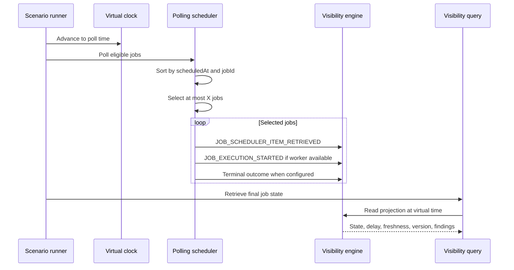
```mermaid
sequenceDiagram
    participant Runner as Scenario runner
    participant Clock as Virtual clock
    participant Poller as Polling scheduler
    participant Engine as Visibility engine
    participant API as Visibility query

    Runner->>Clock: Advance to poll time
    Runner->>Poller: Poll eligible jobs
    Poller->>Poller: Sort by scheduledAt and jobId
    Poller->>Poller: Select at most X jobs
    loop Selected jobs
        Poller->>Engine: JOB_SCHEDULER_ITEM_RETRIEVED
        Poller->>Engine: JOB_EXECUTION_STARTED if worker available
        Poller->>Engine: Terminal outcome when configured
    end
    Runner->>API: Retrieve final job state
    API->>Engine: Read projection at virtual time
    Engine-->>API: State, delay, freshness, version, findings
```

Overflow jobs remain eligible and are considered by the next poll. Retrieval and execution
are distinct because a worker may not be available after the scheduler claims a job.

### 6.3 Idempotent projection with transactional checkpoints

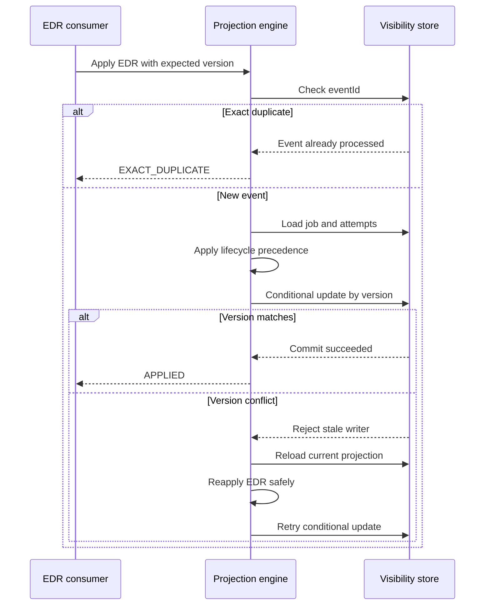
```mermaid
sequenceDiagram
    participant Consumer as EDR consumer
    participant Engine as Projection engine
    participant Store as Visibility store

    Consumer->>Engine: Apply EDR with expected version
    Engine->>Store: Check eventId
    alt Exact duplicate
        Store-->>Engine: Event already processed
        Engine-->>Consumer: EXACT_DUPLICATE
    else New event
        Engine->>Store: Load job and attempts
        Engine->>Engine: Apply lifecycle precedence
        Engine->>Store: Conditional update by version
        alt Version matches
            Store-->>Engine: Commit succeeded
            Engine-->>Consumer: APPLIED
        else Version conflict
            Store-->>Engine: Reject stale writer
            Engine->>Store: Reload current projection
            Engine->>Engine: Reapply EDR safely
            Engine->>Store: Retry conditional update
        end
    end
```

The simulation engine performs equivalent behavior under a process-local reentrant lock.
The durable projector commits projection state and `projected_events` checkpoints together
in EDR PostgreSQL.

### 6.4 Late evidence repairs an overdue job

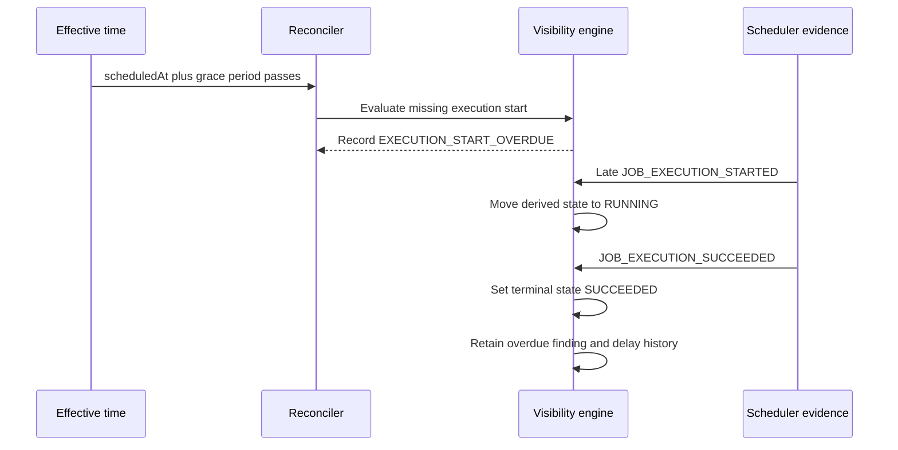
```mermaid
sequenceDiagram
    participant Time as Effective time
    participant Reconciler as Reconciler
    participant Engine as Visibility engine
    participant Scheduler as Scheduler evidence

    Time->>Reconciler: scheduledAt plus grace period passes
    Reconciler->>Engine: Evaluate missing execution start
    Engine-->>Reconciler: Record EXECUTION_START_OVERDUE
    Scheduler->>Engine: Late JOB_EXECUTION_STARTED
    Engine->>Engine: Move derived state to RUNNING
    Scheduler->>Engine: JOB_EXECUTION_SUCCEEDED
    Engine->>Engine: Set terminal state SUCCEEDED
    Engine->>Engine: Retain overdue finding and delay history
```

## 7. Deployment view

### 7.1 Simulation-only local and CI deployment

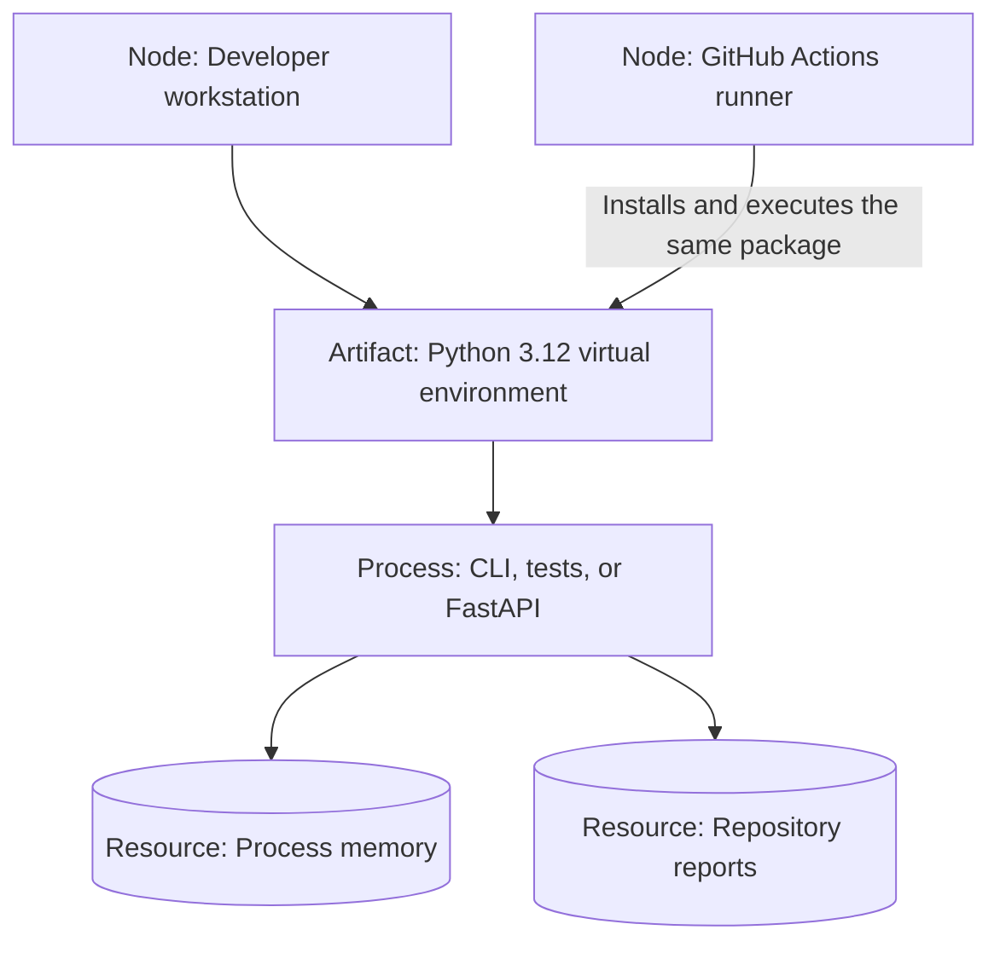
```mermaid
flowchart TB
    developer["Node: Developer workstation"]
    runner["Artifact: Python 3.12 virtual environment"]
    process["Process: CLI, tests, or FastAPI"]
    memory[("Resource: Process memory")]
    files[("Resource: Repository reports")]
    github["Node: GitHub Actions runner"]

    developer --> runner
    runner --> process
    process --> memory
    process --> files
    github -->|"Installs and executes the same package"| runner
```

Properties:

- No external service is required for the simulation suite.
- Process exit discards projected state.
- The CLI writes reports to `simulation-results/`.
- CI executes formatting, linting, tests, and the minimum simulation set.

### 7.2 Production-like local deployment

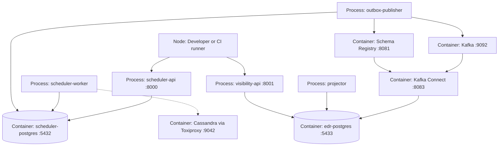
```mermaid
flowchart TB
    workstation["Node: Developer or CI runner"]
    schedulerApi["Process: scheduler-api :8000"]
    visibilityApi["Process: visibility-api :8001"]
    worker["Process: scheduler-worker"]
    publisher["Process: outbox-publisher"]
    projector["Process: projector"]
    schedulerPg[("Container: scheduler-postgres :5432")]
    edrPg[("Container: edr-postgres :5433")]
    kafka["Container: Kafka :9092"]
    registry["Container: Schema Registry :8081"]
    connect["Container: Kafka Connect :8083"]
    cassandra["Container: Cassandra via Toxiproxy :9042"]

    workstation --> schedulerApi
    workstation --> visibilityApi
    schedulerApi --> schedulerPg
    worker --> schedulerPg
    worker -.-> cassandra
    publisher --> schedulerPg
    publisher --> kafka
    publisher --> registry
    kafka --> connect
    registry --> connect
    connect --> edrPg
    projector --> edrPg
    visibilityApi --> edrPg
```

`scripts/infra bootstrap` starts and migrates durable infrastructure. `scripts/infra
up-apps` starts the role-isolated application profile. `scripts/infra smoke-http` verifies
creation, replay, conflict, execution, delivery, projection, attempt history, and search.

Production may replace local containers with managed or clustered services without changing
the authority boundaries. A read replica remains optional; if used, API freshness must
expose replica delay rather than claim strong consistency.

## 8. Cross-cutting concepts

### 8.1 Evidence and state semantics

- Scheduler submission request expresses intent only.
- Scheduler submission acknowledgement proves acceptance only.
- Retrieval evidence proves selection by a poll only.
- Execution start proves runtime activity only.
- Terminal outcome EDRs determine the operational result.
- Absence of evidence is reported as pending, unknown, incomplete, stale, or overdue.

### 8.2 Time

- `eventTime` describes when the source says the fact occurred.
- `ingestionTime` describes when visibility received the fact.
- `dataAsOf` describes the projection's freshness boundary.
- Time-derived status uses an injected effective time.
- Processing delay is `ingestionTime - eventTime` and never changes lifecycle ordering by
  itself.

### 8.3 Idempotency and ordering

- Exact duplicates are identified by `eventId`.
- Semantic execution duplicates are identified by job, attempt, and outcome.
- Terminal precedence prevents late non-terminal events from erasing outcomes.
- Late start or retrieval evidence may backfill timestamps.
- Conflicting terminal outcomes are preserved in audit findings.

### 8.4 Concurrency

- The simulation engine serializes updates with `RLock` and supports expected-version checks.
- Durable scheduler pollers claim eligible work with `FOR UPDATE SKIP LOCKED` and opaque
  lease/fencing tokens.
- Scheduler state, attempt creation, and associated outbox EDRs commit atomically.
- EDR journal identity, projection checkpoints, and Cassandra conditional operations enforce
  idempotency at their respective authority boundaries.

### 8.5 Observability

Every job response should expose:

- Recorded and derived status.
- Version and `dataAsOf`.
- Processing and scheduling delays.
- Attempt and retry summaries.
- Lifecycle completeness flags.
- Active and historical reconciliation findings.

Operational metrics include eligible queue depth, oldest eligible job age, retrieved
batch size, batch saturation, poll duration, skipped polls, claim conflicts, worker wait,
execution delay, EDR processing delay, and projection retries.

### 8.6 Lifecycle volume, storage, and retention

Lifecycle persistence intentionally stores observed facts rather than only the final result.
For example, a scheduled job that fails three times and succeeds on its fourth attempt
normally produces 21 EDRs:

| Phase | Events per phase | EDR count |
| --- | --- | ---: |
| Creation | `JOB_CREATED` | 1 |
| Initial scheduling | submission requested and acknowledged | 2 |
| Attempts 1–3 | retrieved, started, failed, retry requested, retry acknowledged | 15 |
| Attempt 4 | retrieved, started, succeeded | 3 |
| **Total** |  | **21** |

When optional scheduling and retrieval rows are disabled, a reduced lifecycle retaining
attempt and retry evidence is approximately 11 EDRs. The fuller lifecycle uses more storage,
but it makes callback timing, individual failures, retry decisions, and eventual success
auditable.

The following order-of-magnitude estimates assume metadata-only EDRs. They include the
event journal, indexes, projections, attempt summaries, and findings, but exclude large
request or response bodies:

| Completed jobs | Estimated lifecycle storage |
| ---: | ---: |
| 1 job | 40–125 KB |
| 100,000 jobs | 4–12.5 GB |
| 1 million jobs | 40–125 GB |
| 10 million jobs | 400 GB–1.25 TB |

These are capacity-planning ranges, not measured database sizes. Schema design, JSON versus
typed columns, index selection, compression, and average field lengths must be benchmarked
before production sizing. The persistence lifecycle should:

- Keep current job projections and attempt summaries in PostgreSQL.
- Keep raw EDR payloads small and store large bodies in object storage via
  `payloadReference`.
- Retain recent raw EDRs in PostgreSQL for an agreed operational window, initially 30–90
  days.
- Partition `edr_events` by event date and archive older immutable partitions to compressed
  object storage.
- Index operational access paths such as `event_id`, `job_id`, `correlation_id`,
  `event_time`, `edr_type`, and `edr_group`.
- Validate retention periods against audit, privacy, deletion, and recovery requirements.

### 8.7 Security and privacy

The repository supplies local production-like APIs but does not implement an identity
provider. Deployment outside a trusted development network requires:

- Authenticated EDR ingestion and client access.
- Authorization by job type, tenant, or correlation scope.
- TLS in transit and encryption at rest.
- Redaction of error messages and payload references.
- Audit retention and deletion policies.
- Rate limits on ingestion, search, and reconciliation operations.

## 9. Architectural decisions

| Decision | Status | Rationale | Consequence |
| --- | --- | --- | --- |
| Use immutable lifecycle EDRs as facts | Accepted | Facts remain auditable and can rebuild visibility. | Projection rules must handle duplicates and reordering. |
| Separate acknowledgement, retrieval, and execution | Accepted | Each boundary answers a different operational question. | More event types and incomplete-lifecycle cases exist. |
| Use a virtual clock in simulations | Accepted | Timeouts and minute polling become fast and deterministic. | Production wall-clock behavior still requires integration testing. |
| Bound retrieval by configurable `X` | Accepted | Matches the company scheduler and prevents unbounded poll work. | Hotspots create measurable backlog. |
| Keep `recordedStatus` separate from `status` | Accepted | Time-derived conclusions do not overwrite evidence. | Clients must understand both fields. |
| Start with an in-memory engine | Accepted for simulation | Minimizes infrastructure and validates domain rules first. | State is ephemeral and cannot scale across processes. |
| Use separate PostgreSQL scheduler and EDR authorities | Accepted and implemented | Transactions and ownership isolation fit operational and evidence state. | Roles require separate URLs, credentials, migrations, and recovery. |
| Use a transactional scheduler outbox and Kafka | Accepted and implemented | Scheduler commits cannot depend on broker availability. | Publication is at-least-once and journal ingestion must be idempotent. |
| Use Kafka Connect as the raw EDR journal writer | Accepted and implemented | Keeps scheduler/application code outside the EDR authority. | Connector health, DLQ, and offsets are operational dependencies. |
| Separate scheduler and visibility API roles | Accepted and implemented | A combined process would need both database credentials. | Clients use port/service-specific write and read endpoints. |
| Use a standalone fenced polling worker | Accepted and implemented | Multiple replicas can claim bounded disjoint work safely. | Lease, heartbeat, recovery, and backlog age require monitoring. |

## 10. Quality requirements

| Quality | Scenario | Required response |
| --- | --- | --- |
| Precision | Job becomes eligible just after a poll. | Do not mark it overdue during the expected polling interval. |
| Scalability | More than `X` jobs become eligible together. | Retrieve at most `X` per poll and retain overflow without loss. |
| Hotspot resilience | Multiple batches become eligible simultaneously. | Drain deterministically without duplicate claims or starvation. |
| Reliability | Start EDR is missing but success arrives. | Return `SUCCEEDED`, keep `startedAt=null`, and mark lifecycle incomplete. |
| Idempotency | The same event ID arrives twice. | Apply once and do not increment the version twice. |
| Ordering | Start arrives after success. | Backfill time without regressing `SUCCEEDED`. |
| Concurrency | Two writers use the same expected version. | Reject one writer and safely reapply after reload. |
| Freshness | API reads delayed projection data. | Expose `dataAsOf` and stale status. |
| Explainability | Job exceeds its execution grace period. | Return `OVERDUE` while preserving `recordedStatus=SCHEDULED`. |
| Cost | CI runs the core simulation. | Require no external runtime service for behavioral validation. |

The executable evidence for these requirements is summarized in
[`simulation-results/summary.md`](simulation-results/summary.md).

## 11. Risks and technical debt

| Risk | Impact | Mitigation or next step |
| --- | --- | --- |
| Simulation state is in-memory | Simulation API cannot inspect a completed CLI run. | Use the durable application profile for shared operational state. |
| Local topology is single-node per dependency | Laptop chaos cannot establish clustered production availability. | Validate broker, PostgreSQL, Cassandra, and Connect topology separately before release. |
| Polling and batch limits | Large due-job hotspots can accumulate delay. | Monitor oldest-due age, scale workers, and benchmark representative workloads. |
| Application authentication is external | Scheduler write API is unsafe on an untrusted network by itself. | Terminate TLS/authentication at a trusted ingress and add authorization/rate policies. |
| Single Kafka partition key can create hot jobs | Per-job ordering may concentrate skewed traffic. | Measure partition distribution and increase partitions with keyed-order compatibility. |
| Representative production load evidence remains incomplete | Capacity and freshness limits remain estimates. | Complete the versioned Spec 003 workload, backlog recovery, and soak gates. |
| Report files are snapshots | Results can become stale after code changes. | Regenerate them in CI and record the source commit in each report. |
| Poll interval limits precision | Jobs may start up to one minute late before backlog. | Shorten polling or adopt event/timer wake-up for tighter SLAs. |

## 12. Glossary

| Term | Meaning |
| --- | --- |
| EDR | Event data record containing one observed lifecycle fact. |
| `X` | Maximum number of eligible jobs retrieved by one scheduler poll. |
| Recorded status | State directly supported by accepted lifecycle evidence. |
| Derived status | Business state after time-based rules are evaluated. |
| Retrieval | Scheduler selection of an eligible job during a poll. |
| Attempt | One observed execution of a job. |
| Reconciliation finding | Auditable detection of missing, delayed, conflicting, or inconsistent evidence. |
| `dataAsOf` | Latest ingestion time reflected in the projection. |
| Hotspot | A concentrated arrival of eligible work that exceeds immediate batch or worker capacity. |
