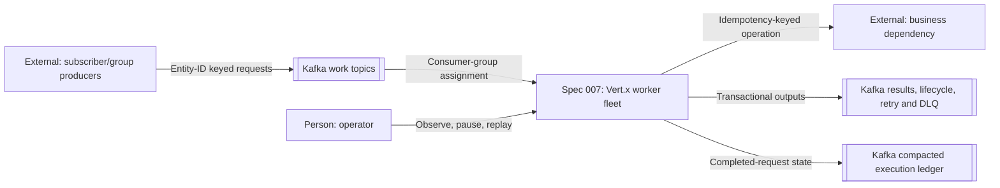
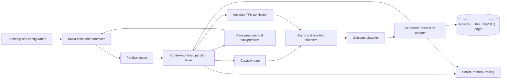
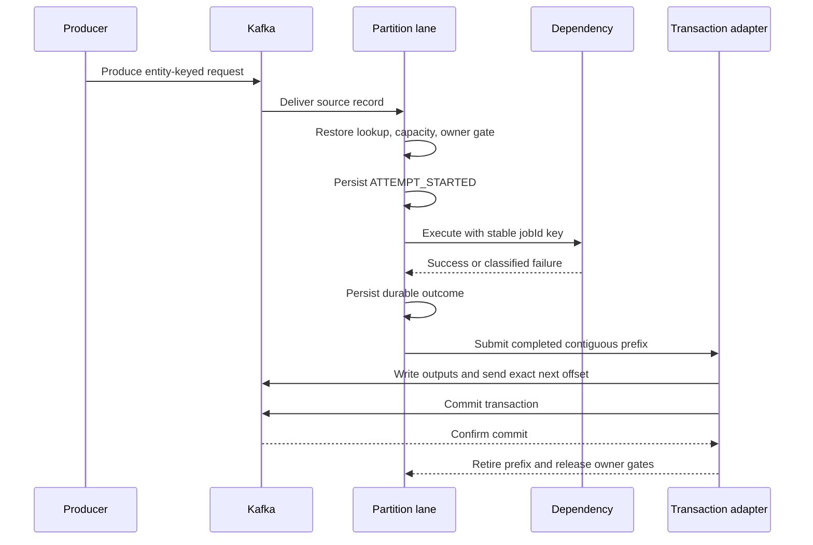
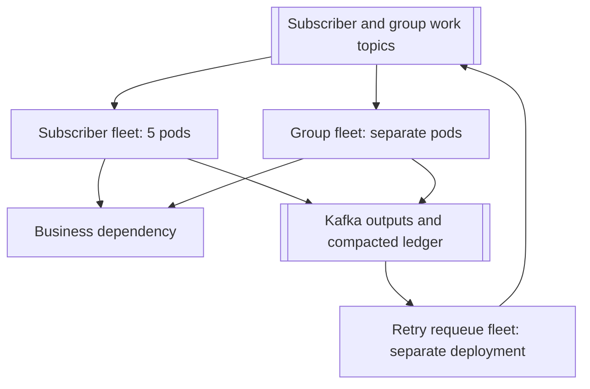

# Spec 007 Vert.x Kafka Pull Worker Architecture

Status: implemented locally; production acceptance and cutover remain open

Last updated: 2026-09-08

This is the root arc42 overview for Spec 007. The [detailed arc42 document](specs/007-vertx-kafka-pull-worker/arc42.md)
and [governing specification](specs/007-vertx-kafka-pull-worker/spec.md) are authoritative for
the complete architecture and requirements.

## 1. Introduction and goals

Spec 007 replaces the Python pull-worker runtime with a Java 21 / Vert.x 5 service for
immediately eligible subscriber and group work. The worker must increase throughput without
losing same-owner ordering, advancing Kafka offsets past unfinished work, or re-executing
completed logical requests within the retention window.

The primary goals are:

- bounded concurrency within and across assigned Kafka partitions;
- FIFO execution for records belonging to the same canonical owner;
- exact source-offset commits coupled atomically to completed output prefixes;
- durable attempt, completion, retry, DLQ, and execution-ledger records;
- workload isolation for subscriber and group fleets;
- adaptive admission under dependency TPS, latency, and failure pressure; and
- observable, fenced, and recoverable rebalances and shutdowns.

## 2. Architecture constraints

- Java 21 and a supported, pinned Vert.x 5 release are required.
- Each pod has one subscribed Kafka consumer for its workload fleet.
- Kafka auto-commit is disabled; fetched or queued records are not treated as processed.
- Each assigned partition has one context-confined lane and a bounded tracking window.
- Business handlers must not block the Vert.x event loop. Blocking work uses a bounded
  worker executor.
- Kafka transactions publish required outputs and the exact safe source-offset prefix
  together.
- External business effects remain at least once across ambiguous external-call failures.
- Production images run as non-root and contain no scheduler database client.

## 3. Context and scope

```mermaid
flowchart LR
    producer["External: subscriber/group producers"]
    kafka[["Kafka work topics"]]
    worker["Spec 007: Vert.x worker fleet"]
    dependency["External: business dependency"]
    outputs[["Kafka results, lifecycle, retry and DLQ"]]
    ledger[["Kafka compacted execution ledger"]]
    operator["Person: operator"]

    producer -->|"Entity-ID keyed requests"| kafka
    kafka -->|"Consumer-group assignment"| worker
    worker -->|"Idempotency-keyed operation"| dependency
    worker -->|"Transactional outputs"| outputs
    worker -->|"Completed-request state"| ledger
    operator -->|"Observe, pause, replay"| worker
```

Inside the worker boundary are configuration validation, consumer control, partition lanes,
capacity and TPS admission, handler adapters, outcome classification, transaction
coordination, ledger restoration, health, metrics, and tracing. Kafka, Schema Registry,
business dependencies, identity/secrets, monitoring, and downstream visibility projections
are external boundaries.

The worker is not a scheduler database, due-job poller, scheduler outbox, or visibility API.
It consumes work that is already immediately eligible.

## 4. Solution strategy

1. Route subscriber and group work to isolated topics and consumer groups keyed by their
   canonical entity IDs.
2. Subscribe one consumer per pod and route each assigned partition to one local lane.
3. Register delivered records in order before dispatching them.
4. Run different owners concurrently under partition and pod capacity limits while holding
   same-owner gates through transaction commit.
5. Persist `ATTEMPT_STARTED` before invocation and `JOB_COMPLETED` before marking success.
6. Collect only the oldest contiguous completed prefix of each partition.
7. Publish outputs, ledger state, and the exact next source offset in one Kafka transaction.
8. Pause intake at bounded watermarks or output failure boundaries and resume after recovery.
9. Restore durable completion state before readiness and fence late callbacks by assignment
   epoch and execution token.

## 5. Building-block view

```mermaid
flowchart LR
    config["Bootstrap and configuration"] --> consumer["Kafka consumer controller"]
    consumer --> router["Partition router"]
    router --> lanes["Context-confined partition lanes"]
    lanes --> capacity["Capacity gate"]
    lanes --> limiter["Adaptive TPS admission"]
    capacity --> handlers["Async and blocking handlers"]
    limiter --> handlers
    handlers --> classifier["Outcome classifier"]
    classifier --> tx["Serialized transaction adapter"]
    tx --> lanes
    tx --> outputs[("Results, EDRs, retry/DLQ, ledger")]
    lanes --> pressure["Pause/resume and backpressure"]
    pressure --> consumer
    lanes --> telemetry["Health, metrics, tracing"]
    tx --> telemetry
```

| Responsibility | Implementation area |
| --- | --- |
| Lifecycle, health, and supervision | `WorkerVerticle`, `PullRuntime` |
| Consumer assignment and fencing | `MetadataConsumer` |
| Owner FIFO and offset contiguity | `PartitionLane`, `ContiguousCompletionTracker` |
| Transactions and exact offsets | `TransactionAdapter` |
| Durable completion restoration | `LedgerStore` |
| Capacity and adaptive admission | `CapacityGate`, `TokenBucket`, `AdaptiveAdmission` |
| Handler execution | `HttpBusinessHandler`, `BlockingBusinessHandler` |
| Contracts and migration checks | `Job`, `RouteMigration`, `MigrationGuard` |

## 6. Runtime view

```mermaid
sequenceDiagram
    participant Producer
    participant Kafka
    participant Lane as Partition lane
    participant Dependency
    participant Tx as Transaction adapter

    Producer->>Kafka: Produce entity-keyed request
    Kafka->>Lane: Deliver source record
    Lane->>Lane: Restore lookup, capacity, owner gate
    Lane->>Lane: Persist ATTEMPT_STARTED
    Lane->>Dependency: Execute with stable jobId key
    Dependency-->>Lane: Success or classified failure
    Lane->>Lane: Persist durable outcome
    Lane->>Tx: Submit completed contiguous prefix
    Tx->>Kafka: Write outputs and send exact next offset
    Tx->>Kafka: Commit transaction
    Kafka-->>Tx: Confirm commit
    Tx-->>Lane: Retire prefix and release owner gates
```

For a partition with committed next offset 100, records 100 and 101 may complete while 102
is running and 103 is complete. The worker retains 103 and commits no farther than 102 until
102 completes; then it commits the whole safe prefix with next offset 104. A later completed
record never permits the worker to commit past an unfinished earlier record.

## 7. Deployment view

The baseline subscriber deployment uses ten Kafka partitions, five pods, and ten shared
handler slots per pod. Kafka assigns partitions approximately two per pod. Group work uses a
separate topic, consumer group, deployment, pool, TPS budget, and capacity budget. Retry
requeue processing is separately deployed and may be scaled to zero.

```mermaid
flowchart TB
    topics[["Subscriber and group work topics"]]
    subscriber["Subscriber fleet: 5 pods"]
    group["Group fleet: separate pods"]
    retry["Retry requeue fleet: separate deployment"]
    dependency["Business dependency"]
    outputs[["Kafka outputs and compacted ledger"]]

    topics --> subscriber
    topics --> group
    outputs --> retry
    subscriber --> dependency
    group --> dependency
    retry --> topics
    subscriber --> outputs
    group --> outputs
```

Pods beyond a workload topic's partition count are idle by design. Partition lanes are local
coordinators, not extra consumers. The local Compose profile and `scripts/spec007` provide
build, smoke, baseline, capacity, and chaos workflows.

## 8. Cross-cutting concepts

### 8.1 Ordering and idempotency

Same-owner records are serialized through their Kafka commit boundary. Different owners in a
partition may overlap. Exact event identity and completed logical `(jobId, attempt)` identity
are retained in durable Kafka-backed state. A matching completed request is committed through
the ordered tracker without invoking the business dependency again.

### 8.2 Failure and recovery

Output or transaction failure pauses affected intake and retains source offsets. Rebalance
epochs fence late callbacks. Shutdown drains within a bounded deadline; uncommitted records
are replayable from Kafka. Readiness is withheld until assignment and ledger restoration are
complete.

### 8.3 Observability and security

Health, assignment, lane, queue, capacity, TPS, handler, transaction, lag, restore, retry,
and ledger metrics are required. Traces carry job and partition context without exposing
payloads. Kafka ACLs, TLS, secret management, payload controls, and downstream authorization
are deployment responsibilities.

## 9. Quality requirements and risks

| Quality | Required behavior |
| --- | --- |
| Correctness | Never commit past an unfinished delivered record. |
| Ordering | Same-owner work remains FIFO through confirmed transaction commit. |
| Concurrency | Distinct owners can overlap within and across partitions. |
| Resilience | Output failure, rebalance, restart, and worker loss preserve replayability. |
| Duplicate handling | Completed logical requests do not re-invoke the handler within retention. |
| Backpressure | Queue, capacity, TPS, and dependency pressure bound new work. |
| Operability | Readiness, health, metrics, traces, and evidence expose the worker state. |

Remaining risks are environment-specific capacity, dependency idempotency, production Kafka
topology and ACLs, migration sequencing, and the gap between local synthetic-handler evidence
and real business throughput. See the [Spec 007 evidence report](docs/spec-007-evidence.md)
and [runbook](docs/spec-007-runbook.md) for current gates, migration, and rollback.

## 10. Glossary

| Term | Meaning |
| --- | --- |
| EDR | Durable event data record describing an attempt or lifecycle fact. |
| Owner | Canonical subscriber or group entity whose records must remain ordered. |
| Partition lane | Context-confined coordinator for one assigned Kafka partition. |
| Completed prefix | Oldest contiguous set of delivered records safe to commit. |
| Ledger | Durable completed-request state used for duplicate suppression. |
| Retry requeue | Separate deployment that republishes retryable work without executing it. |