# Real Persistence and Kafka Architecture

Status: proposed for review  
Last updated: 2026-08-19  
Governing specification: [`spec.md`](spec.md)

This document follows the arc42 structure and uses C4-style diagrams for context,
containers, components, and deployment. It describes the target architecture for Spec 002;
the repository remains an in-memory simulator until the accompanying implementation plan is
executed.

## Contents

- [1. Introduction and Goals](#1-introduction-and-goals)
- [2. Architecture Constraints](#2-architecture-constraints)
- [3. Context and Scope](#3-context-and-scope)
- [4. Solution Strategy](#4-solution-strategy)
- [5. Building-Block View](#5-building-block-view)
- [6. Runtime View](#6-runtime-view)
- [7. Deployment View](#7-deployment-view)
- [8. Cross-Cutting Concepts](#8-cross-cutting-concepts)
- [9. Architecture Decisions](#9-architecture-decisions)
- [10. Quality Requirements](#10-quality-requirements)
- [11. Risks and Technical Debt](#11-risks-and-technical-debt)
- [12. Glossary](#12-glossary)
- [13. Primary Technical References](#13-primary-technical-references)

## 1. Introduction and Goals

### 1.1 Purpose

The system schedules jobs durably and exposes an evidence-based view of their lifecycle.
The scheduler's operational queue and the EDR audit/visibility model serve different
purposes and therefore use separately owned PostgreSQL databases.

Kafka is the asynchronous boundary between them. Scheduler changes produce lifecycle EDRs
through a transactional outbox. Kafka Connect persists the EDRs into the EDR database. A
projection worker derives the business visibility model only from persisted EDRs.

A third database, Cassandra, supplies demonstration workload records. The worker performs a
read–compute–delay–conditional-update flow against them, creating realistic timeout,
unknown-write-outcome, conflict, and retry chaos without making Cassandra scheduler, outbox,
EDR, or visibility authority.

### 1.2 Architecture goals

| Priority | Goal | Architecture response |
| ---: | --- | --- |
| 1 | No committed fact is lost | Scheduler mutations and outbox records commit atomically; Kafka and the sink retry. |
| 2 | Evidence remains truthful | The visibility side reads EDR evidence and never queries scheduler internals. |
| 3 | Durable restart recovery | Scheduler jobs, raw EDRs, projection checkpoints, attempts, and findings live in PostgreSQL. |
| 4 | Duplicate-safe delivery | `eventId`, payload hashing, database constraints, and projection checkpoints make at-least-once delivery safe. |
| 5 | Independent failure domains | Scheduler and EDR databases have distinct URLs, credentials, migrations, and owners. |
| 6 | Horizontal work sharing | Pollers, outbox publishers, and projectors use bounded claims with row locking or leases. |
| 7 | Auditable transport | Schema version plus Kafka topic, partition, and offset are retained with every stored EDR. |
| 8 | Reproducible development | Local containers run two PostgreSQL databases, Kafka, Schema Registry, and Kafka Connect. |

### 1.3 Stakeholders

| Stakeholder | Concern |
| --- | --- |
| Operations | Can backlog, lag, connector failure, and database outage be detected and recovered? |
| Application teams | Does committing a job also guarantee eventual lifecycle publication? |
| Support and audit | Can a visible state be traced to immutable EDRs and Kafka coordinates? |
| Platform engineers | Are ownership, credentials, scaling, retention, and migrations independent? |
| Test engineers | Can crashes, duplicates, reordering, and dependency outages be reproduced? |
| API clients | Is visibility durable, evidence-based, and explicit about freshness? |
| Security teams | Is access least-privilege and are payloads protected throughout the pipeline? |

## 2. Architecture Constraints

### 2.1 Business constraints

- The lifecycle and evidence semantics in Spec 001 remain authoritative.
- Submission intent does not prove scheduler acknowledgement.
- Scheduler acknowledgement does not prove retrieval or execution.
- The scheduler may poll once per minute and take at most a configured `X` jobs.
- The API must expose missing, incomplete, stale, or overdue evidence instead of inventing
  scheduler facts.
- Raw EDR retention and access must support audit and privacy policies.

### 2.2 Mandatory technology and ownership constraints

- PostgreSQL is used for both persistence roles.
- The scheduler and EDR stores are different logical databases even when colocated locally.
- Kafka carries lifecycle EDRs between the two ownership domains.
- Kafka Connect JDBC Sink is the only normal writer of raw `edr_events` rows.
- No runtime transaction, foreign key, or query spans persistence stores.
- The visibility API has no scheduler-database dependency.
- The scheduler has no EDR-database dependency on its synchronous mutation path.
- Cassandra is a worker workload dependency only; it never stores scheduler or visibility
  authority.
- Python remains at version 3.12 or newer; FastAPI and Pydantic remain the HTTP and domain
  boundaries.

### 2.3 Delivery constraints

- The end-to-end delivery contract is at least once.
- Exactly-once behavior is achieved at the domain boundary through idempotency, not claimed
  as a distributed transport guarantee.
- Per-job ordering is encouraged with a `jobId` Kafka key, but projection correctness must
  tolerate out-of-order facts.
- The JDBC sink needs a schema-aware Kafka value whose fields form a Connect struct.
- Destructive automatic table creation or schema evolution by the connector is disabled.

### 2.4 Current implementation constraints

- `VisibilityEngine` owns in-memory dictionaries and a process-local lock.
- The API directly applies `POST /edrs` to that engine.
- CLI simulation runs and API runs do not share state.
- The pure lifecycle behavior has useful test coverage and should be extracted rather than
  rewritten inside repositories.
- Existing fast unit and simulation tests must remain infrastructure-free.

## 3. Context and Scope

### 3.1 C4 level 1 — system context

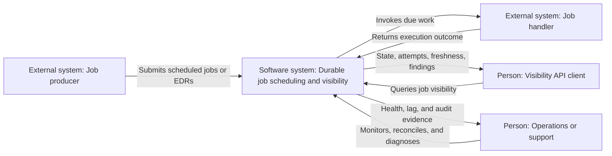

### 3.2 System boundary

Inside the boundary are the job API, polling scheduler, workers, outbox publisher, Kafka
topic configuration, Kafka Connect connector configuration, projection worker,
reconciler, visibility API, both PostgreSQL schemas, the Cassandra demonstration schema and
seed tooling, and the built-in demo handlers.

Kafka, PostgreSQL, Schema Registry, Kafka Connect runtime, metrics backend, and secret store
may be managed infrastructure, but their configuration and contracts are part of the
solution.

Production job handlers beyond the built-in demos, calling applications, identity
providers, and long-term object archives are outside the implementation boundary.

### 3.3 External interfaces

| Interface | Direction | Consistency | Purpose |
| --- | --- | --- | --- |
| Durable job submission | Inbound | Strong within scheduler DB | Create a scheduler job and its initial EDR outbox records. |
| `POST /edrs` | Inbound | Broker-acknowledged, eventually visible | Accept integration EDRs when this endpoint is enabled. |
| Kafka `job-lifecycle-edr.v1` | Internal asynchronous | At least once | Carry canonical lifecycle facts. |
| Job handler contract | Outbound/inbound | Per attempt | Invoke work and receive an outcome. |
| Visibility query endpoints | Outbound | Eventually consistent | Return durable projection state and freshness. |
| Reconciliation endpoint/worker | Internal or privileged inbound | Transactional in EDR DB | Detect and retain lifecycle findings. |
| Health and metrics | Outbound | Near-real-time | Report dependency, backlog, and lag state. |

## 4. Solution Strategy

The architecture applies these strategies in order:

1. Persist the operational job and its lifecycle outbox records in one scheduler-database
   transaction.
2. Let independent outbox publishers lease unpublished records and publish schema-aware EDRs
   to Kafka with `jobId` as the key.
3. Use a versioned JSON Schema contract so Kafka Connect receives a structured value.
4. Let Kafka Connect enrich the record with topic, partition, and offset and upsert it into
   a pre-migrated EDR journal.
5. Protect journal immutability with a canonical payload hash and a database trigger:
   identical retries are no-ops; identity collisions fail and reach the DLQ.
6. Project only persisted EDR rows, so rebuilding visibility never depends on Kafka
   retention or scheduler-database access.
7. Commit one projection event, its job/attempt changes, decisions, and findings in one EDR
   transaction.
8. Keep the current lifecycle reducer independent from persistence and wall-clock access so
   the existing deterministic suite remains fast.

This is deliberately not a distributed transaction. Temporary outages become observable
backlogs at an explicit boundary: outbox backlog, Kafka consumer lag, or projection lag.

## 5. Building-Block View

### 5.1 C4 level 2 — target containers

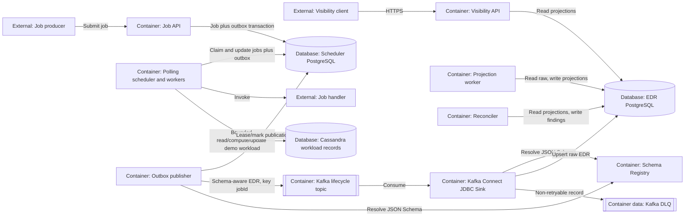

Container independence is logical. An initial deployment may package the Python roles in
one image and select the role by command, while still running each role as a separate
process with least-privilege credentials.

### 5.2 Scheduler application components

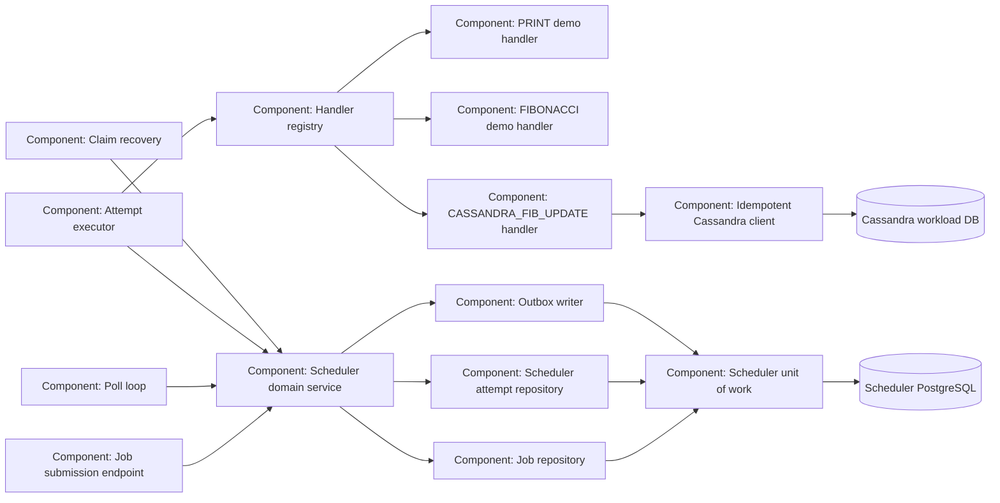

The scheduler unit of work is the only supported way to commit a lifecycle-changing job
mutation. It commits the operational row, attempt row where applicable, and outbox record
together.

### 5.3 Outbox publisher components

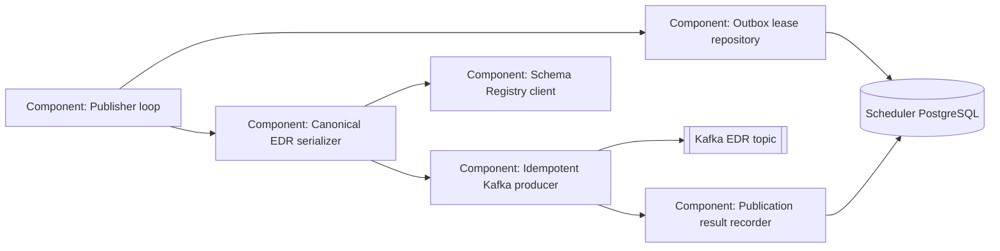

The publisher uses a short database transaction to claim records with a lease, performs the
network publish outside that transaction, and then records success or retry. A crash at any
point can cause a replay but cannot lose the outbox record.

### 5.4 Kafka sink components

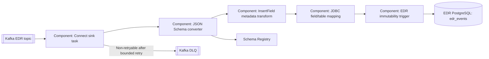

The event value contains typed lifecycle fields plus a canonical JSON string of the domain
payload. The JDBC connector can map that string into PostgreSQL `jsonb`. A database trigger
or equivalent write guard derives/verifies the payload hash. On an `event_id` conflict it:

- preserves the existing row when the hashes match, including its first Kafka coordinates;
- rejects the write when the hashes differ, preventing event mutation.

Kafka Connect's `InsertField` transform adds topic, partition, and offset to the sink value.
Connector configuration maps camel-case transport fields to pre-migrated snake-case columns
and uses `eventId` from the record value as the primary key.

### 5.5 Visibility-side components

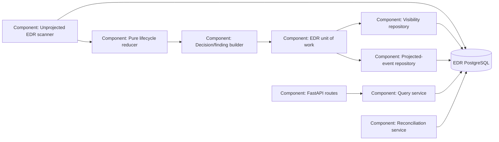

The reducer accepts current domain state plus an event and returns updated state and a
decision without opening connections, committing, reading wall-clock time, or publishing
messages. Repository adapters translate durable rows to and from the existing domain
models.

### 5.6 Data model and ownership

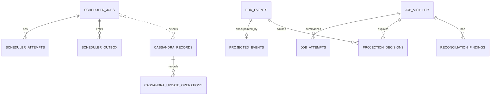

The scheduler, EDR, and Cassandra groups are in separate databases. The apparent
relationships across groups are identifiers carried in job/event payloads, not foreign keys
or cross-database joins.

Primary access paths are:

| Table | Primary/unique keys | Principal indexes |
| --- | --- | --- |
| `scheduler_jobs` | `job_id` | eligible partial index on state, `available_at`, `job_id`; `correlation_id` |
| `scheduler_attempts` | `(job_id, attempt_number)` | outcome and claim-expiry operations as measured |
| `scheduler_outbox` | `event_id` | unpublished state, `next_attempt_at`, creation time; lease expiry |
| `edr_events` | `event_id`; Kafka coordinate tuple | `(job_id, event_time, event_id)`; `persisted_at` |
| `projected_events` | `event_id` | completion/lease fields when leases are used |
| `job_visibility` | `job_id` | status/schedule; correlation; freshness filters |
| `job_attempts` | `(job_id, attempt_number)` | job ID through primary-key prefix |
| Cassandra `records_by_bucket` | `((dataset_id, bucket), record_id)` | Partition-key reads with ordered record ranges |
| Cassandra `update_operations_by_bucket` | `((dataset_id, bucket), record_id, operation_id)` | Same-partition idempotency lookup by logical operation |

## 6. Runtime View

### 6.1 Submit a job and make its facts visible

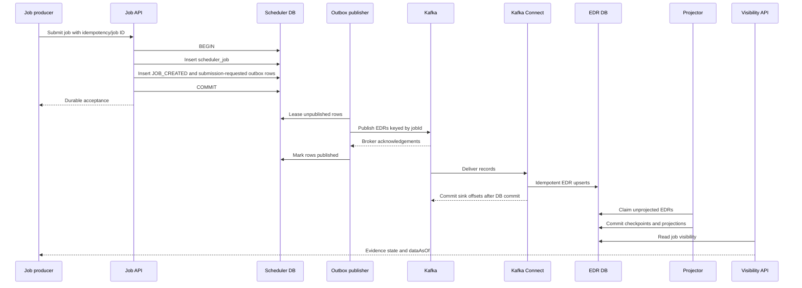

The job API response proves only durable scheduler-side acceptance. Visibility becomes
available asynchronously after outbox publication, sink persistence, and projection.

### 6.2 Concurrent polling and demonstration execution

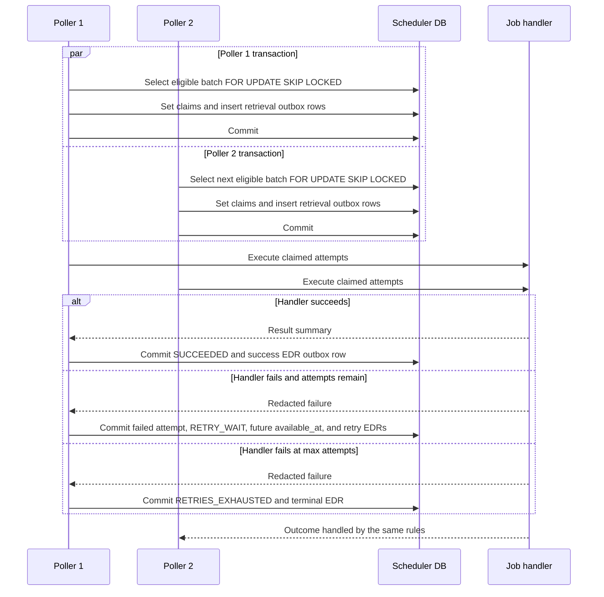

No database lock is held while a handler runs. The claim lease represents ownership during
execution and allows recovery after a worker crash.

The initial in-process handler registry contains `PRINT`, `FIBONACCI`, and
`CASSANDRA_FIB_UPDATE`. `PRINT` writes a configured message to structured output. `FIBONACCI`
computes all values up to a configured maximum of `10000` (ending at `6765`). These are
success-only smoke jobs. `CASSANDRA_FIB_UPDATE` provides the realistic failure surface: it
reads a seeded selection of `X`, chooses the greatest `input_number`, calculates Fibonacci,
waits for a controlled delay, and conditionally updates the chosen record's result/checksum.

A new job starts with `available_at = scheduled_at`. A retry retains the original
`scheduled_at`, sets internal state `RETRY_WAIT`, and moves `available_at` to the calculated
retry instant. The ordinary poller—not a separate retry path—claims it only after that time.

### 6.2.1 Cassandra timeout, retry, and fencing

```mermaid
sequenceDiagram
    participant W as Worker
    participant SDB as Scheduler DB
    participant C as Cassandra through chaos proxy

    W->>SDB: Commit RUNNING, start time, start EDR, and claim token
    W->>C: Read deterministic X records in bounded pages
    C-->>W: Rows with input_number and checksum
    W->>W: Select max, calculate Fibonacci, wait configured delay
    loop While handler is active
        W->>SDB: Heartbeat claim using worker ID and fencing token
    end
    W->>SDB: Confirm fencing token before mutation
    W->>C: Reserve row and apply idempotent operation/checksum +1
    alt Update succeeds or matching operation marker exists
        C-->>W: Applied exactly once
        W->>SDB: Commit SUCCEEDED if fencing token still current
    else Read/write timeout or connection loss
        C--xW: Unknown/retryable outcome
        W->>C: Reconcile row and stable operation marker
        W->>SDB: Commit success if applied; otherwise retryable failure if token is current
    else Conditional checksum/reservation conflict
        C-->>W: Not applied
        W->>W: Bounded reread/recompute or retryable failure
    else Claim heartbeat/token is lost
        SDB--xW: Conditional update rejected
        W->>W: Stop and never commit scheduler outcome
    end
```

The Cassandra table is partitioned by `(dataset_id, bucket)`. A seed determines a stable
bucket/range sequence; there is no server-side random scan or `ALLOW FILTERING`. The handler
streams the maximum candidate instead of retaining all record bodies. Fibonacci input and
delay are bounded. Driver retries are bounded so scheduler attempts remain the visible retry
unit.

The operation ID is stable for the logical job across attempts. `checksum` is a normal
version column, not a Cassandra counter. A conditional reservation plus a same-partition
operation marker distinguishes an unapplied mutation from a lost response after success. If
the operation marker already exists, a recovered attempt treats the Cassandra side effect as
complete without incrementing again. Distinct jobs that select the same record serialize on
the observed checksum or retry after a bounded conflict.

Local chaos tests place a network fault proxy between worker and Cassandra. Latency above
the request deadline, a lost update response, connection interruption, and Cassandra
unavailability must produce real client exceptions. After the fault is removed, the same job
payload selects the same records and reconciles the same operation ID on its next attempt.

### 6.3 Publisher crash after Kafka acknowledgement

```mermaid
sequenceDiagram
    participant O as Outbox publisher
    participant SDB as Scheduler DB
    participant K as Kafka
    participant KC as Kafka Connect
    participant EDB as EDR DB

    O->>SDB: Lease event evt-1
    O->>K: Publish evt-1
    K-->>O: Acknowledged
    Note over O: Process crashes before marking published
    SDB-->>O: Lease expires
    O->>K: Republish evt-1
    K->>KC: Deliver one or both Kafka records
    KC->>EDB: Upsert event_id evt-1
    EDB-->>KC: First insert; matching retries are no-op
```

Kafka producer idempotence reduces retry duplicates within one producer session. The
stable domain `eventId` handles duplicates across publisher processes and sessions.

### 6.4 EDR database outage and recovery

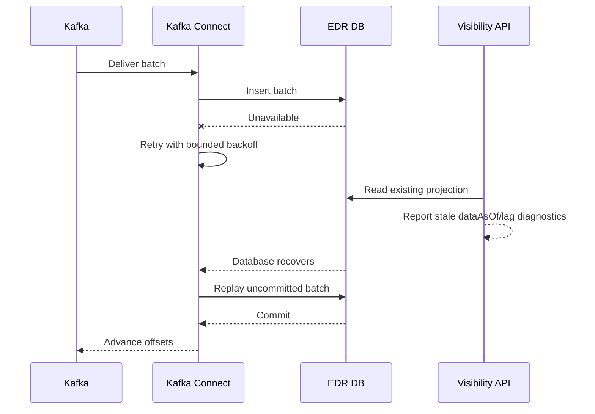

Transient dependency failure does not send valid records directly to the DLQ. The
connector exhausts the configured retry window before classifying a record-level failure as
non-retryable.

### 6.5 Idempotent projection with concurrent workers

```mermaid
sequenceDiagram
    participant W1 as Projector 1
    participant W2 as Projector 2
    participant DB as EDR DB

    W1->>DB: Claim unprojected event A
    W2->>DB: Skip locked A and claim event B
    W1->>DB: Lock/load job and attempts
    W1->>DB: Apply reducer; write decision and checkpoint
    W1->>DB: Commit
    W2->>DB: Lock/load relevant job
    alt Same job, later event
        DB-->>W2: Current version after W1
    end
    W2->>DB: Apply reducer; write decision and checkpoint
    W2->>DB: Commit
```

If events for the same job are processed in a different order, Spec 001's precedence and
backfill rules still apply. The unique projected-event checkpoint prevents double apply.

### 6.6 Poison record and identity collision

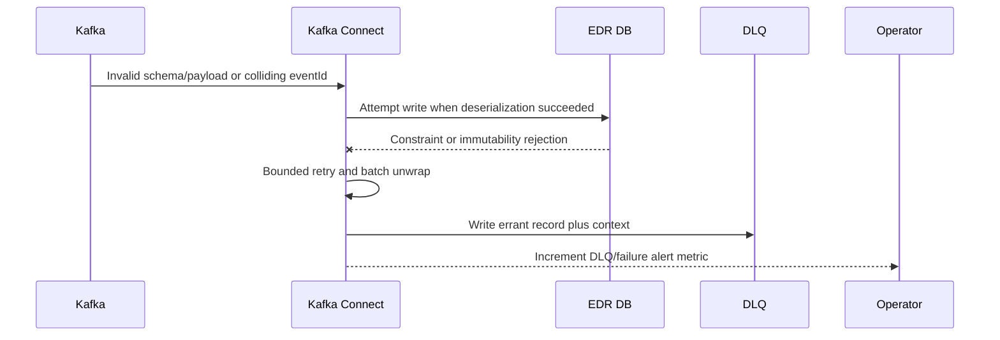

An operator decides whether to correct and republish with a new `eventId`, replay the same
fact, or reject it permanently. Automated DLQ replay is not allowed without validation.

### 6.7 Projection rebuild

1. Stop projection writers for the isolated target or create new shadow projection tables.
2. Retain `edr_events` unchanged.
3. Clear only rebuildable checkpoints, projections, decisions, and derived findings.
4. Replay EDRs in stable persisted order through the same reducer.
5. Compare counts, terminal states, attempts, and quality findings.
6. Atomically switch readers to validated shadow tables or resume writers.

Production rebuild procedure must prefer shadow tables so visibility remains available and
the current projection can be restored.

## 7. Deployment View

### 7.1 Local development and infrastructure tests

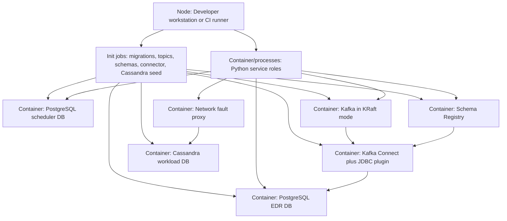

The composition uses health checks and pinned images/plugins. Persistent volumes are
optional for ordinary tests and enabled for explicit restart/durability tests. Test cleanup
removes only resources bearing the composition's project label.

### 7.2 Production topology

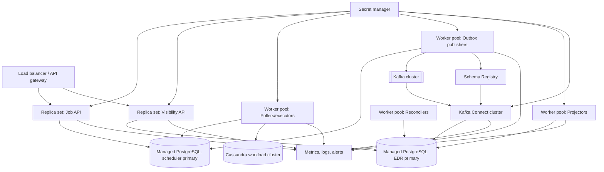

The first production release reads visibility from the EDR primary to avoid adding replica
staleness before the ingestion pipeline is established. A read replica may be added later
if `dataAsOf` and replica-lag semantics are verified end to end.

### 7.3 Scaling units

| Unit | Scaling signal | Coordination mechanism |
| --- | --- | --- |
| Job API | Request rate and latency | Stateless replicas |
| Pollers | Eligible queue depth and oldest `available_at` | `SKIP LOCKED` claims |
| Executors | Claimed/runnable attempts and handler latency | Claim leases |
| Cassandra reads | Rows/pages, request latency, timeouts, and node capacity | Bounded pages/concurrency and Cassandra partitioning |
| Outbox publishers | Unpublished count and oldest age | Outbox leases |
| Connect sink tasks | Kafka lag and database throughput | Kafka partition assignment |
| Projectors | Oldest unprojected age and throughput | Row locks/checkpoints |
| Visibility API | Query rate and database latency | Stateless replicas |
| Reconciler | Scan duration and finding backlog | Partitioned/leased scans |

Database write throughput and Kafka partition count set upper bounds. Scale tests must
confirm that adding workers helps before production concurrency is increased.

## 8. Cross-Cutting Concepts

### 8.1 Domain boundaries and repositories

The codebase is divided into domain logic and adapters:

- Scheduler domain services depend on scheduler repository and unit-of-work protocols.
- Lifecycle projection is a pure reducer over domain models.
- PostgreSQL adapters implement those protocols with SQLAlchemy 2.
- In-memory adapters remain available for deterministic simulations and focused unit tests.
- FastAPI routes depend on application services, never on ORM sessions directly.
- The `CASSANDRA_FIB_UPDATE` handler depends on a narrow workload-store protocol exposing
  bounded selection, conditional reservation/update, and operation reconciliation; local
  smoke handlers do not depend on Cassandra.

No repository interface exposes a method that joins scheduler, EDR, and Cassandra data.

### 8.2 Transaction boundaries

| Operation | Transaction boundary |
| --- | --- |
| Submit job | Scheduler job plus initial outbox facts |
| Claim batch | Scheduler claims plus retrieval outbox facts |
| Start/heartbeat attempt | Short scheduler transaction fenced by claim token |
| Cassandra workload transform | No transaction shared with scheduler; bounded read, compute/delay, and conditional mutation |
| Complete attempt | Job/attempt outcome plus outcome/retry outbox facts |
| Lease/mark outbox | Short scheduler-DB lease or completion transaction |
| Sink batch | Kafka Connect-managed EDR-DB transaction |
| Project event | Checkpoint, projection, attempts, decisions, findings in EDR DB |
| Reconcile batch | Finding creation/resolution in EDR DB |

External handler calls and Kafka publication never occur while holding a scheduler job-row
transaction lock.

### 8.3 Idempotency

- Job creation uses caller-supplied `jobId` or an explicit idempotency key.
- Each lifecycle transition creates a stable, persisted `eventId` once.
- Outbox publication retries reuse that ID and identical canonical bytes.
- Kafka producer idempotence reduces duplicates within a producer session.
- `edr_events.event_id` and its hash guard deduplicate sink replays.
- `projected_events.event_id` deduplicates projector replay.
- `(job_id, attempt_number)` prevents semantic attempt inflation.
- Cassandra selection is deterministic by dataset, requested count, and seed, so a
  retry produces the same logical workload.
- The logical operation ID is stable across job attempts; an operation marker and normal
  checksum version prevent a retry from incrementing twice after an unknown write outcome.
- Scheduler outcome updates require the current claim fencing token, preventing zombie
  workers from committing after lease recovery.
- API retries never rely on Kafka offset as the business identity.

### 8.4 Ordering and concurrency

Kafka is keyed by `jobId` for normal per-job order. Ordering is not treated as truth because
late producers, historical replay, and operational repair can still reorder events.

Scheduler jobs use row locking for claims and a numeric version for stale updates.
Visibility jobs serialize conflicting writes with a row lock or compare-and-swap version.
Unrelated jobs remain independently processable.

### 8.5 Time semantics

| Timestamp | Meaning |
| --- | --- |
| `eventTime` | When the source says the lifecycle fact occurred. |
| `ingestionTime` | When the producing boundary accepted the fact. |
| Kafka record timestamp | Transport timestamp; diagnostic, not lifecycle truth. |
| `persisted_at` | When the EDR database accepted the sink row. |
| `dataAsOf` | Latest ingestion evidence incorporated in a visibility projection. |
| Claim/lease times | Operational coordination timestamps from the owning database clock. |

Database time is used for claim and lease expiry to avoid disagreement between workers.
All domain timestamps are timezone-aware UTC.

### 8.6 Schema and serialization

The selected wire format is JSON Schema managed by Schema Registry. It preserves the
existing readable JSON contract while providing the Connect struct required by the JDBC
sink. Compatibility is backward-transitive unless an implementation spike demonstrates a
connector limitation that requires a documented alternative.

The record contains:

- a primitive string key equal to `jobId`;
- typed, camel-case canonical EDR fields;
- `schemaVersion`;
- `canonicalPayload`, a deterministic JSON string excluding transport-enrichment fields;
- sink-added Kafka metadata fields.

Canonicalization sorts object keys, uses UTF-8, normalizes UTC timestamp formatting, and
uses compact JSON separators. The payload hash is SHA-256 over those canonical bytes.

Schema auto-registration is enabled only in local development. Delivery environments
register schemas as a deployment step and producers use an already approved compatible
version.

### 8.7 Configuration and secrets

Settings are typed and validated at process startup. The scheduler and EDR URLs are separate
required settings for roles that need them; a role never receives an unused database secret.
Configuration rejects URLs resolving to the same logical database in non-test modes.

Only the Cassandra-capable worker receives Cassandra contact points, keyspace, credentials,
consistency, record/input/page/concurrency limits, processing-delay limit,
request/execution deadlines, and conditional retry limit. Payload values cannot raise those
limits beyond deployment policy.

Secrets are loaded from environment injection or a secret manager and redacted from logs,
exceptions, traces, and health output. TLS is mandatory outside local development.

### 8.8 Observability

Structured logs carry `eventId`, `jobId`, `correlationId`, `traceId`, worker role, and Kafka
coordinates where applicable. Payloads and connection strings are excluded.

Metrics cover four queues:

```text
scheduler eligible jobs
        -> unpublished outbox
        -> Kafka / sink lag
        -> unprojected EDRs
```

For each queue, expose count, oldest-item age, throughput, failures, and retry counts. Health
has separate liveness and readiness. Pipeline diagnostics aggregate but do not hide the
status of Kafka, Schema Registry, Connect worker/task, both databases, and projection lag.
Worker diagnostics additionally expose Cassandra rows/pages, selected maximum, Fibonacci
and delay duration, conditional updates, checksum transitions, conflicts, operation-marker
recovery, read/write timeouts, unavailability, connection failures, active operations,
heartbeat failures, and stale-token rejections.

### 8.9 Security and privacy

- Job API and scheduler credentials modify only scheduler-owned tables.
- Outbox credentials read/lease the outbox but do not access the EDR database.
- Connect credentials write only `edr_events` through the approved insert/upsert path.
- Projector credentials read raw events and write projection tables but cannot change raw
  event content.
- Visibility credentials read projection tables only.
- Reconciler credentials can update findings but not raw EDRs.
- Cassandra worker credentials can read the dataset and mutate only the approved
  result/checksum/reservation fields and operation-marker table; seed tooling uses a separate
  schema/data-management identity.
- Kafka ACLs separate producer, connector consumer, DLQ producer, and operator roles.
- Large or sensitive payload bodies remain behind `payloadReference`; EDRs contain only the
  operationally necessary metadata.

### 8.10 Migration, retention, and rebuild

Scheduler and EDR Alembic histories have different version tables and migration locations.
Deployment applies expand/migrate/contract changes before dependent processes start.

`edr_events` is immutable and partition-ready by `persisted_at` or a separately agreed event
date. Retention must exceed the required projection-rebuild and incident-investigation
window. Archival and privacy deletion are explicit operational workflows, not application
side effects.

Projection tables are rebuildable; scheduler tables and raw EDRs are not.

### 8.11 Error handling

Errors are classified as:

- transient dependency errors: retry with bounded exponential backoff and jitter;
- concurrency conflicts: reload and reapply within a bounded attempt count;
- invalid domain input: reject at the synchronous boundary before persistence;
- poison Kafka record: send to DLQ after connector retry/unwrap;
- event identity collision: preserve original row, reject new record, alert;
- Cassandra read/write timeout, unavailable, connection loss, or unresolved conditional
  conflict: reconcile the stable operation ID, then fail retryably only when not applied and
  attempts remain;
- invalid Cassandra job/dataset/schema or integrity mismatch: fail as non-retryable unless
  policy explicitly overrides it;
- lost claim fencing token: cancel/discard work and reject any late outcome;
- exhausted application retry: retain durable state and expose operator action.

No worker discards a failed record merely to advance its loop.

## 9. Architecture Decisions

| ID | Decision | Status | Rationale | Consequence |
| --- | --- | --- | --- | --- |
| ADR-002-01 | Use two logical PostgreSQL databases. | Accepted by Spec 002 | Operational jobs and evidence have different ownership and failure domains. | Separate URLs, roles, migrations, backups, and capacity plans are required. |
| ADR-002-02 | Use a transactional outbox, not an application dual write. | Accepted | A scheduler commit cannot atomically include a Kafka publish. | Publication is asynchronous and can duplicate. |
| ADR-002-03 | Key lifecycle Kafka records by `jobId`. | Accepted | Normal per-job ordering and partition locality simplify operations. | One extremely hot job cannot be parallelized within the topic. |
| ADR-002-04 | Use versioned JSON Schema through Schema Registry. | Proposed | Retains readable JSON and supplies the Connect struct required by JDBC Sink. | Adds registry infrastructure and compatibility governance. |
| ADR-002-05 | Let Kafka Connect persist raw EDRs only. | Accepted by Spec 002 | Keeps transport persistence independent from domain projection. | A separate projection worker and measurable projection lag are required. |
| ADR-002-06 | Project from durable `edr_events`, not directly from Kafka. | Proposed | Raw persistence becomes the recovery boundary and rebuild source. | Adds one database scan/claim stage after sink latency. |
| ADR-002-07 | Use connector upsert plus an immutable hash guard. | Proposed | Connector recovery is duplicate-safe without allowing mutable facts. | Requires a tested PostgreSQL trigger and DLQ behavior. |
| ADR-002-08 | Guarantee at least once plus idempotency. | Accepted by Spec 002 | This is achievable across outbox, Kafka, sink, and projector boundaries. | Every stage requires stable identities and replay tests. |
| ADR-002-09 | Keep pure/in-memory adapters beside PostgreSQL adapters. | Accepted | Simulation tests must remain deterministic and fast. | Both adapter suites must satisfy shared contract tests. |
| ADR-002-10 | Read EDR primary in the first durable release. | Proposed | Avoids a second source of freshness lag during initial rollout. | Read scaling is deferred until measured. |
| ADR-002-11 | Use Cassandra as a read/compute/update demonstration workload store. | Accepted by Spec 002 | Real read, delay, conditional write, and availability failures exercise retries more credibly than artificial Fibonacci failures. | Adds a third datastore, driver, seed lifecycle, constrained write role, metrics, and chaos environment. |
| ADR-002-12 | Use seeded partition/range selection, not server-side random scans. | Proposed | Cassandra queries must follow the partition model and tests must be reproducible. | Payload carries dataset/count/seed and selection is pseudo-random rather than statistically sampled by Cassandra. |
| ADR-002-13 | Fence long-running worker outcomes with claim tokens and heartbeats. | Proposed | A timed-out Cassandra call may complete after lease recovery by another worker. | Worker must heartbeat, cancel on lease loss, and condition every outcome update on the current token. |
| ADR-002-14 | Use stable operation IDs, conditional versions, and operation markers for Cassandra updates. | Proposed | A write timeout has an unknown outcome and blind/counter increments can apply more than once. | Each logical job increments checksum once; adds lightweight-transaction cost and reconciliation logic. |

### 9.1 Rejected alternatives

| Alternative | Reason rejected |
| --- | --- |
| One database with separate schemas | Does not exercise independent credentials, migration, backup, or outage boundaries required by Spec 002. |
| Scheduler writes EDR database directly | Creates a forbidden dual write and couples scheduler availability to evidence storage. |
| Projector writes the raw EDR journal | Violates the Kafka Sink ownership requirement and conflates transport with projection. |
| Project directly from Kafka and omit raw DB journal | Rebuild then depends on Kafka retention and cannot guarantee a durable audit journal. |
| Use Kafka offsets as event identity | A replayed fact can have a new offset; offsets identify deliveries, not domain facts. |
| Rely on producer idempotence alone | It does not deduplicate across a publisher crash and new producer session. |
| Enable connector auto-create/auto-evolve | Allows runtime traffic to mutate an audited database schema outside migrations. |
| Claim global exactly-once semantics | PostgreSQL/Kafka/Connect do not share one transaction and connector support is implementation-specific. |
| Make Fibonacci fail randomly | Does not model a genuine dependency failure and produces nondeterministic tests. |
| Ask Cassandra for arbitrary random rows | Conflicts with Cassandra partition-oriented access and is difficult to reproduce. |
| Use a Cassandra counter for checksum | After timeout the client cannot determine whether a counter increment applied, making safe retry impossible. |

## 10. Quality Requirements

### 10.1 Quality tree

```text
Quality
├── Reliability
│   ├── committed job/outbox atomicity
│   ├── duplicate-safe EDR persistence
│   └── restart and outage recovery
├── Integrity
│   ├── immutable EDR identity
│   ├── projection determinism
│   └── database ownership isolation
├── Performance
│   ├── bounded scheduler claims
│   ├── observable pipeline latency
│   └── horizontally shared workers
├── Operability
│   ├── backlog and lag metrics
│   ├── explicit migrations and health
│   └── DLQ diagnosis
└── Maintainability
    ├── pure domain reducer
    ├── repository contracts
    └── reproducible local stack
```

### 10.2 Quality scenarios

| ID | Stimulus | Required response and measure |
| --- | --- | --- |
| Q-REL-01 | Process or container restarts after committed job/projection writes. | State is unchanged after restart; no committed row is lost. |
| Q-REL-02 | Publisher crashes after broker acknowledgement. | Republish is safe; one raw event and one projection decision exist for `eventId`. |
| Q-REL-03 | Kafka is unavailable while jobs complete. | Scheduler transactions commit; outbox age grows visibly; all rows publish after recovery. |
| Q-REL-04 | EDR DB is unavailable. | Kafka retains uncommitted records; sink catches up after recovery without valid records entering DLQ. |
| Q-INT-01 | Existing `eventId` is delivered with different content. | Original row remains byte-equivalent; collision is rejected and alerted. |
| Q-INT-02 | Events arrive out of lifecycle order. | Spec 001 terminal precedence and backfill tests still pass. |
| Q-ISO-01 | One database or its credential is unavailable. | The other ownership domain does not query it or treat its own data as a fallback authority. |
| Q-CON-01 | Two pollers request work concurrently. | Each `(job_id, attempt_number)` is claimed by at most one live lease. |
| Q-CON-02 | Two projectors see related events. | Each event checkpoint commits once; job updates are serializable through locks/versioning. |
| Q-WORK-01 | A due Fibonacci job with limit 10000 is claimed. | Worker computes through 6765, commits `SUCCEEDED`, emits success evidence, and creates no retry. |
| Q-WORK-02 | A due Cassandra job requests 10,000 seeded records. | Worker selects the deterministic maximum, computes Fibonacci, delays, updates that record, increments checksum once, commits `SUCCEEDED`, and creates no retry. |
| Q-WORK-03 | Proxy latency exceeds the Cassandra deadline on attempt one. | Attempt is retryably failed, job waits until future `available_at`, and attempt two performs or reconciles the same operation after fault removal. |
| Q-WORK-04 | Cassandra is unavailable through `max_attempts`. | Exactly the configured attempts run; job becomes `RETRIES_EXHAUSTED` and is no longer eligible. |
| Q-WORK-05 | Cassandra applies the update but its response is lost. | Retry finds the operation marker, checksum remains incremented once, and scheduler commits success. |
| Q-WORK-06 | Cassandra responds after the worker loses its claim token. | Stale scheduler outcome is rejected; recovered worker reconciles the stable operation without a second increment. |
| Q-WORK-07 | Two jobs select the same maximum record. | Conditional versioning serializes distinct operations; each increments once or fails retryably after bounded conflicts. |
| Q-PERF-01 | Healthy pipeline receives normal load. | End-to-end visibility meets the configurable 10-second eventual-consistency target at the agreed percentile. |
| Q-PERF-02 | More than `X` jobs are due. | Each poll claims at most `X`, overflow stays eligible, and oldest age is measurable. |
| Q-OPS-01 | A poison event reaches the connector. | It is diagnosable in the DLQ after bounded retry and later valid records continue per policy. |
| Q-OPS-02 | Connector task stops. | Readiness/diagnostics and alerting show task failure; a running worker process alone is not reported healthy. |
| Q-MNT-01 | Developer runs behavioral unit tests. | No infrastructure is required and virtual-time determinism is preserved. |
| Q-MNT-02 | Developer runs the durable suite. | One documented command provisions, tests, and safely tears down the isolated stack. |

Throughput, database size, partition count, retention, recovery time, and latency percentiles
other than the existing 10-second freshness target require measured workload inputs before
production sizing.

## 11. Risks and Technical Debt

| Risk | Impact | Mitigation or validation |
| --- | --- | --- |
| JDBC upsert normally updates on conflict | A reused `eventId` could mutate audit evidence. | Implement and integration-test the hash-based PostgreSQL no-op/reject guard before enabling connector traffic. |
| Connector field/type mapping differs by version | Deployment can fail or write incorrect timestamp/JSON types. | Pin the connector and driver; run a contract spike with JSON Schema, JSONB, timestamps, SMT metadata, and DLQ before schema implementation proceeds. |
| DLQ tolerance can hide data loss | Poison records may accumulate while the pipeline appears active. | Alert on every DLQ write and expose DLQ count/age in readiness diagnostics. |
| Database-tail projection adds latency | Visibility has an extra asynchronous hop. | Index/claim by `persisted_at`, measure lag, batch adaptively, and keep the 10-second target. |
| Long projection transactions reduce concurrency | Hot jobs or large batches can hold locks. | Use small bounded batches, per-event commits initially, and measure before batching writes. |
| Outbox table grows indefinitely | Scheduler queries and backups degrade. | Partition/archive published rows after a safety window; never delete unpublished rows. |
| Kafka key hotspot | One job with excessive events stays on one partition. | Preserve correctness; alert on pathological job volume rather than violating order. |
| Two database migrations increase release complexity | Partial deployment can break one role. | Independent pre-deploy migration jobs, compatibility checks, and rollback runbooks. |
| Local infrastructure is resource-heavy | Developer and CI feedback can slow down. | Keep unit suite infrastructure-free; run durable suite separately and cache pinned images. |
| Current engine mixes storage and reducer behavior | Persistence work may regress lifecycle rules. | Add characterization tests, extract reducer first, and share repository contract tests. |
| Sensitive content leaks into EDR payload or DLQ | Privacy/security incident. | Prefer references, redact logs, restrict DLQ access, and test payload policy. |
| Production load profile is unknown | Partition/index sizing may be wrong. | Add representative load generation and record sizing before production sign-off. |
| Large Cassandra jobs exhaust worker memory/connections | Other jobs starve or processes fail. | Enforce record/page/concurrency limits, stream only the maximum candidate, and apply bulkheads. |
| Driver retries multiply scheduler retries | Attempts take unexpectedly long and evidence hides real requests. | Use explicit bounded driver policy and a whole-execution deadline; expose driver retry metrics. |
| Slow reply races claim recovery | A zombie worker overwrites the recovered attempt. | Fence heartbeats/outcomes with opaque claim tokens and test delayed replies through the proxy. |
| Cassandra write timeout has unknown outcome | Blind retry can increment checksum twice. | Reconcile a stable operation marker and conditional normal version; forbid counter columns. |
| Concurrent jobs select one maximum row | Conditional updates conflict or starve. | Reserve by observed checksum, use bounded LWT conflict retries, and expose contention metrics. |
| Single-node local Cassandra differs from production | Availability/consistency behavior can be misleading. | Use it only for functional chaos; validate production topology and consistency separately. |

## 12. Glossary

| Term | Meaning |
| --- | --- |
| Canonical payload | Deterministically serialized domain EDR used for hashing and audit comparison. |
| Connect struct | Schema-bearing Kafka Connect record value whose named fields can map to JDBC columns. |
| Cassandra workload database | Worker dependency containing versioned demo inputs/results and operation markers, never scheduler or visibility authority. |
| Logical operation ID | Stable ID derived from job and handler contract, reused across attempts to reconcile Cassandra side effects. |
| DLQ | Kafka dead-letter topic containing non-retryable sink records and error context. |
| Due/eligible job | Job whose `available_at` has passed and whose internal state permits a claim. |
| EDR database | Separate PostgreSQL database containing immutable events and derived visibility data. |
| Event identity collision | Reuse of one `eventId` for different canonical content. |
| Expired claim | A worker lease whose expiry passed before the attempt reached a durable outcome. |
| Outbox | Scheduler-owned rows atomically committed with state changes and later published to Kafka. |
| Projection checkpoint | Durable proof that one `eventId` has been applied to visibility state. |
| Scheduler database | PostgreSQL database containing operational queue, attempts, claims, and outbox. |
| Sink | Kafka Connect JDBC task that writes Kafka EDRs to the EDR database. |
| Visibility lag | Time between fact ingestion and its inclusion in the query projection. |

## 13. Primary Technical References

- [Apache Kafka producer configuration](https://kafka.apache.org/documentation/#producerconfigs)
  for idempotence and acknowledgement constraints.
- [Apache Kafka Connect user guide](https://kafka.apache.org/documentation/#connect)
  for worker behavior, error handling, dead-letter queues, and transforms.
- [Confluent JDBC Sink overview](https://docs.confluent.io/kafka-connectors/jdbc/current/sink-connector/overview.html)
  for PostgreSQL upsert and JSON/JSONB mapping behavior.
- [Confluent JDBC Sink configuration](https://docs.confluent.io/kafka-connectors/jdbc/current/sink-connector/sink_config_options.html)
  for `record_value` keys, retries, batching, and schema controls.
- [Confluent Schema Registry serialization formats](https://docs.confluent.io/platform/current/schema-registry/fundamentals/serdes-develop/overview.html)
  for JSON Schema support and compatibility governance.
- [Apache Cassandra quickstart](https://cassandra.apache.org/doc/latest/cassandra/getting-started/cassandra-quickstart.html)
  for the local container and CQL setup model.
- [Apache Cassandra CQL data manipulation](https://cassandra.apache.org/doc/latest/cassandra/developing/cql/dml.html)
  for conditional updates, same-partition batches, and lightweight-transaction costs.
- [Apache Cassandra data types](https://cassandra.apache.org/doc/stable/cassandra/developing/cql/types.html)
  for the unknown-outcome warning on timed-out counter mutations.
- [Apache Cassandra Python driver](https://github.com/apache/cassandra-python-driver)
  for the worker client and request timeout behavior.
