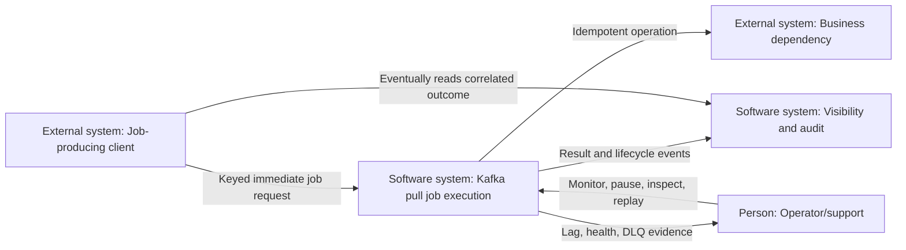
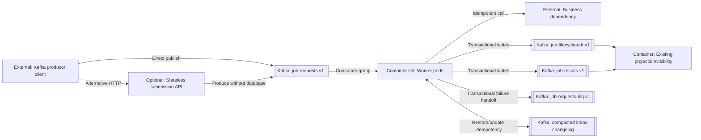
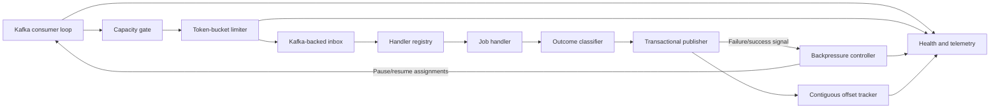
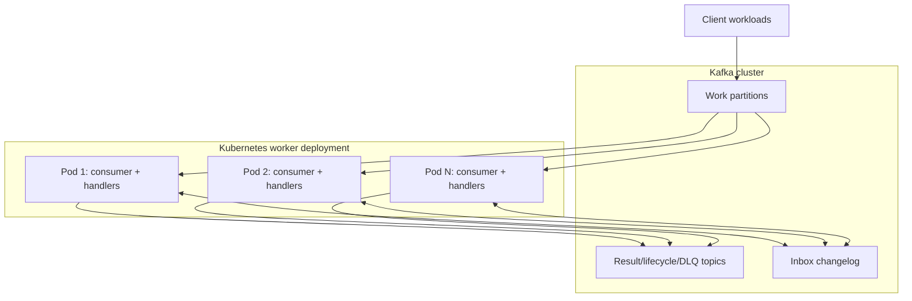

# Kafka Pull-Based Job Scheduler Architecture

Status: proposed for review

Last updated: 2026-09-06

Governing specification: [`spec.md`](spec.md)

This document follows arc42 and uses C4-style diagrams. It describes the target Kafka-only
execution architecture for Spec 006.

## Contents

- [1. Introduction and Goals](#1-introduction-and-goals)
- [2. Architecture Constraints](#2-architecture-constraints)
- [3. Context and Scope](#3-context-and-scope)
- [4. Solution Strategy](#4-solution-strategy)
- [5. Building-Block View](#5-building-block-view)
- [6. Runtime View](#6-runtime-view)
- [7. Deployment View](#7-deployment-view)
- [8. Cross-Cutting Concepts](#8-cross-cutting-concepts)
- [9. Architecture Decisions](#9-architecture-decisions)
- [10. Quality Requirements](#10-quality-requirements)
- [11. Risks and Technical Debt](#11-risks-and-technical-debt)
- [12. Glossary](#12-glossary)

## 1. Introduction and Goals

### 1.1 Purpose

Clients submit immediately executable jobs directly to Kafka. A horizontally scaled worker
group pulls those requests, limits starts per pod, applies backpressure during downstream
publication failure, and explicitly advances source offsets only after a safe durable
boundary. The scheduler database, database poller, due-job dispatcher, and work outbox are
not part of this runtime.

### 1.2 Architecture goals

| Priority | Goal | Architectural response |
| ---: | --- | --- |
| 1 | No acknowledged request is lost | Kafka acknowledgement is submission acknowledgement; offsets advance only at safe boundaries. |
| 2 | Safe duplicate delivery | Stable `jobId`, partition ordering, Kafka-backed inbox state, and idempotent handlers. |
| 3 | Bounded dependency load | Per-pod token bucket plus bounded concurrency and queues. |
| 4 | Failure backpressure | Assigned partitions pause while required Kafka writes fail; polling continues for heartbeats. |
| 5 | Durable failure handling | Permanent/exhausted requests reach a dedicated DLQ before source commit. |
| 6 | Horizontal scaling | One consumer group distributes partitions across worker pods. |
| 7 | Explainable operation | Lag, offset, throttling, pause state, retries, and DLQ activity are observable. |

### 1.3 Stakeholders

| Stakeholder | Concern |
| --- | --- |
| Client teams | How to publish safely, interpret acknowledgement, and correlate results. |
| Platform engineers | Topic capacity, credentials, quotas, rebalances, and transactions. |
| Worker owners | Handler idempotency, rate limits, concurrency, and shutdown. |
| Operations | Backlog, pauses, DLQ recovery, replay, and hot partitions. |
| Audit/support | Immutable request, outcome, lifecycle, and failure evidence. |
| Security | Direct client access, payload governance, and replay permissions. |

## 2. Architecture Constraints

### 2.1 Functional constraints

- Spec 006 requests are eligible immediately when published.
- The client supplies an immutable, globally stable `jobId` and Kafka key.
- All workers for a logical workload share one consumer group.
- Auto-commit is disabled.
- Success, retry, and DLQ source offsets advance only after their required durable outputs.
- The TPS limit applies independently to each pod, not globally to the fleet.
- Lifecycle EDR and visibility semantics from earlier specifications remain authoritative.

### 2.2 Technology constraints

- Kafka is the durable operational queue and source of execution truth.
- `job-requests.v1`, `job-results.v1`, `job-lifecycle-edr.v1`, and
  `job-requests-dlq.v1` are distinct topic contracts.
- Kafka producer idempotence is enabled; transactional producers are used to couple output
  records and consumed offsets.
- Transactional consumers use `read_committed` isolation.
- Schemas are registered and compatibility checked before rollout.
- Worker concurrency, queues, timeouts, retries, and shutdown are finite.

### 2.3 Consequences of removing the scheduler database

- There is no native future scheduling or delayed retry. A separate timer service would be
  required and is outside Spec 006.
- Status, search, audit, and attempts are derived from Kafka lifecycle/result projections.
- Producer idempotence does not deduplicate a retry from a new producer session; domain
  idempotency remains mandatory.
- Kafka cannot atomically include an arbitrary external business side effect. Handlers must
  provide an idempotency key or durable conditional boundary.
- Cancellation requires a separately designed command and race policy.

## 3. Context and Scope

### 3.1 C4 level 1 — system context



### 3.2 System boundary

Inside the solution boundary are topic/schema contracts, shared producer library or
optional stateless submission API, worker runtime, handler registry, Kafka-backed inbox
state, rate limiter, backpressure controller, offset coordinator, transactional output
publisher, metrics, health, and DLQ tooling.

Managed Kafka, Schema Registry, identity/secret systems, business dependencies, visibility
storage, and monitoring backends may be externally operated. Their interfaces and required
configuration remain architecture contracts.

### 3.3 External interfaces

| Interface | Direction | Consistency | Purpose |
| --- | --- | --- | --- |
| `job-requests.v1` | Inbound | Broker-acknowledged, at least once | Immediately eligible commands. |
| Business handler | Outbound | Handler-specific | Perform idempotent work. |
| `job-results.v1` | Outbound | Transactional with source offset | Immutable attempt/result evidence. |
| `job-lifecycle-edr.v1` | Outbound | Transactional with source offset | Visibility lifecycle evidence. |
| `job-requests-dlq.v1` | Outbound | Transactional with source offset | Quarantined permanent/exhausted work. |
| Health/metrics/traces | Outbound | Near real time | Operability and diagnosis. |

## 4. Solution Strategy

1. A client validates and publishes a keyed, versioned command with idempotent production.
2. Kafka acknowledges durable submission; execution remains asynchronous.
3. A group assigns each partition to one worker pod.
4. The pod polls bounded batches and dispatches only when queue, concurrency, TPS, and
   backpressure gates permit.
5. A Kafka-backed inbox/result state identifies completed or conflicting duplicates.
6. The handler performs its side effect through a stable operation idempotency key.
7. The worker transactionally writes result/lifecycle/retry/DLQ records and source offsets.
8. Publication failure pauses affected work while heartbeat polls preserve membership.

The design provides Kafka exactly-once processing for Kafka records when transactions are
enabled, but only at-least-once end-to-end execution because external side effects are not
inside the Kafka transaction.

## 5. Building-Block View

### 5.1 C4 level 2 — containers



### 5.2 Worker components



## 6. Runtime View

### 6.1 Successful request

```mermaid
sequenceDiagram
    participant C as Client producer
    participant K as Kafka
    participant W as Worker
    participant B as Business dependency

    C->>K: Produce keyed request
    K-->>C: Broker acknowledgement
    W->>K: Poll request
    W->>W: Acquire TPS token and check inbox
    W->>B: Execute with idempotency key
    B-->>W: Success
    W->>K: Begin transaction; result + lifecycle + inbox
    W->>K: Send source offset; commit transaction
    K-->>W: Transaction committed
```

### 6.2 Required publication failure

```mermaid
sequenceDiagram
    participant K as Kafka
    participant W as Worker
    W->>K: Publish required output transaction
    K--xW: Timeout/failure
    W->>W: Abort transaction; retain source offset
    W->>K: Pause assigned partition(s)
    loop Heartbeat and bounded recovery probes
        W->>K: Poll while paused
    end
    W->>K: Resume after recovery threshold
```

### 6.3 Permanent failure

The worker classifies the record, begins a Kafka transaction, publishes terminal result,
lifecycle, and DLQ envelopes, adds the source offset, and commits. Any failure aborts the
transaction, leaves the source offset unchanged, and activates backpressure. A crash after
an external side effect but before commit causes redelivery and relies on handler
idempotency.

### 6.4 Rebalance and shutdown

Revocation stops dispatch for affected partitions. The pod drains only to a bounded
deadline and commits the highest contiguous safe offset; unfinished work is abandoned for
redelivery. Shutdown first fails readiness, then follows the same bounded drain path.

## 7. Deployment View



Maximum active parallelism is bounded by partition count. Each pod has a unique consumer
instance and transactional producer identity. Rolling updates use readiness and sufficient
termination grace. Autoscaling uses lag/age but caps replicas and therefore aggregate TPS.

## 8. Cross-Cutting Concepts

### 8.1 Delivery and transactions

Auto-commit is disabled. Output records and consumed offsets use Kafka transactions and
`read_committed` readers. Concurrent partition processing advances only through contiguous
completed offsets. Transactional IDs are unique and fenced across pod generations.

### 8.2 Idempotency

The domain key is `(jobId, attempt)`. Matching duplicates converge; conflicting immutable
payloads are rejected. Kafka-backed inbox state is restored before a partition accepts
work. External targets receive a stable operation key or use a durable conditional write.

### 8.3 Backpressure and rate limiting

A token bucket gates handler starts per pod. Capacity exhaustion or Kafka output failure
pauses partitions without stopping heartbeat polls. Recovery uses bounded jittered probes.
Readiness and liveness distinguish sustained inability to process from a dead process.

### 8.4 Security

Clients have write-only work-topic access. Workers read their group, write named output
topics, and own only their transactional IDs. DLQ read/replay is separately privileged and
audited. Schemas, payload size, quotas, encryption, and redaction are centrally enforced.

### 8.5 Observability

Correlation includes `jobId`, attempt, topic, partition, offset, transaction, and worker
identity. Metrics cover lag/age, assignments, pauses, TPS waits, concurrency, transaction
aborts, retries, DLQ, rebalances, and idempotent duplicates.

## 9. Architecture Decisions

| ID | Decision | Rationale | Consequence |
| --- | --- | --- | --- |
| ADR-006-01 | Kafka replaces the scheduler database in the new path. | Removes database polling and makes the queue the pull boundary. | No database queries for operational job state. |
| ADR-006-02 | Only immediately eligible jobs are accepted. | Kafka partitions are not delayed queues. | Future scheduling needs another service. |
| ADR-006-03 | Default key is `jobId`. | Preserves per-job order and duplicate locality. | Key skew limits throughput. |
| ADR-006-04 | One consumer group represents one worker fleet. | Kafka distributes partition ownership. | Replicas beyond partitions are idle. |
| ADR-006-05 | TPS is enforced per pod with a token bucket. | Simple and locally enforceable. | Fleet TPS changes with replica count. |
| ADR-006-06 | Required publication failure pauses partitions. | Prevents consuming work whose outcome cannot be made durable. | Lag grows visibly during outage. |
| ADR-006-07 | Kafka transactions couple outputs and source offsets. | Avoids partial Kafka handoffs. | Unique transactional IDs and `read_committed` are required. |
| ADR-006-08 | End-to-end semantics remain at least once. | External side effects cannot join Kafka transactions. | Handler idempotency is compulsory. |

## 10. Quality Requirements

| Scenario | Required response |
| --- | --- |
| Broker acknowledges submission | Request survives client exit and is eventually assigned within retention/SLO bounds. |
| Output Kafka write fails | No source commit; pod pauses new work and continues heartbeat polls. |
| Pod dies after side effect | Request redelivers; stable operation key prevents duplicate logical effect. |
| Pod exceeds TPS demand | Starts remain within configured rate/burst; lag grows rather than dependency load. |
| Permanent poison record | DLQ/result/lifecycle and source offset commit atomically. |
| Rebalance during concurrent work | No offset advances over unfinished earlier work. |
| New producer session resubmits | Kafka-backed domain idempotency detects the duplicate. |

## 11. Risks and Technical Debt

| Risk | Impact | Mitigation |
| --- | --- | --- |
| External side effect is not transactional with Kafka | Duplicate physical calls | Target idempotency keys, durable conditional writes, fault tests. |
| Direct Kafka access expands client responsibility | Schema/security/configuration drift | Shared producer SDK or stateless submission API. |
| Hot keys or too few partitions | Low throughput and head-of-line blocking | Capacity test, skew metrics, reviewed key strategy. |
| Retry is immediate | Dependency amplification | TPS gate, attempt limit, backpressure; add timer service only by new design. |
| Kafka-backed inbox restore is slow | Rebalance recovery delay | Bounded state, standby replicas where justified, restore metrics. |
| Transaction misconfiguration | Duplicated/hidden outputs | Startup validation, unique IDs, `read_committed`, integration tests. |
| No operational job table | Query/cancel behavior is eventually consistent | Result/lifecycle projections and separate cancellation contract. |

## 12. Glossary

| Term | Meaning |
| --- | --- |
| Safe offset | Next Kafka offset after a contiguous set whose required durable work is complete. |
| Kafka-backed inbox | Restorable state keyed by job/attempt that prevents repeated logical execution. |
| Backpressure | Pausing dispatch while retaining records and consumer membership. |
| Immediate retry | A new attempt published without a scheduled delay. |
| DLQ | Kafka topic containing permanent or exhausted failures plus source coordinates. |
| Logical outcome | Domain result after duplicate deliveries are collapsed by idempotency. |
