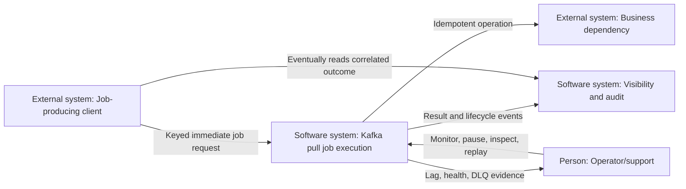
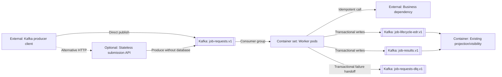
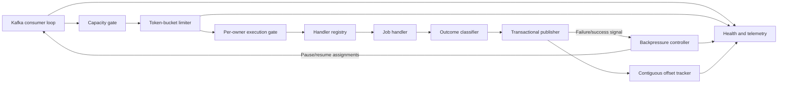
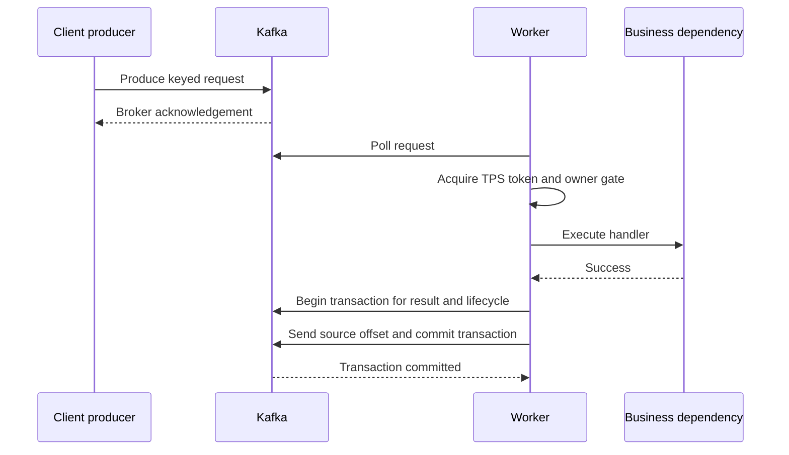
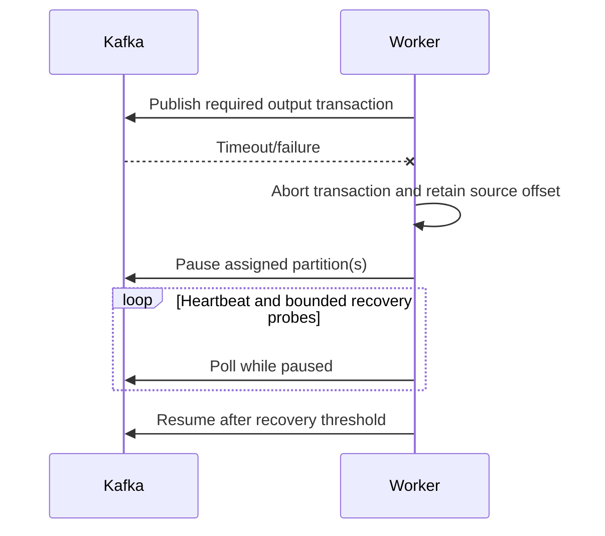
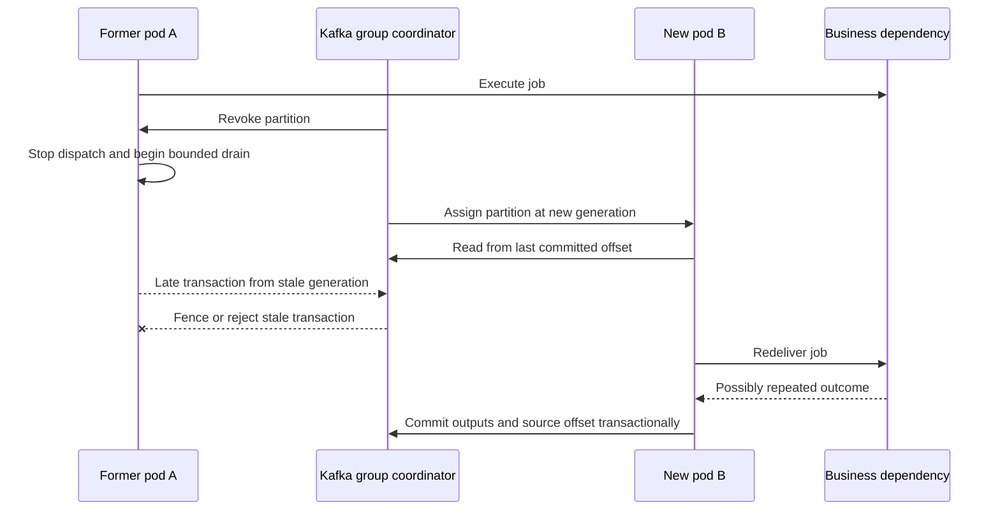
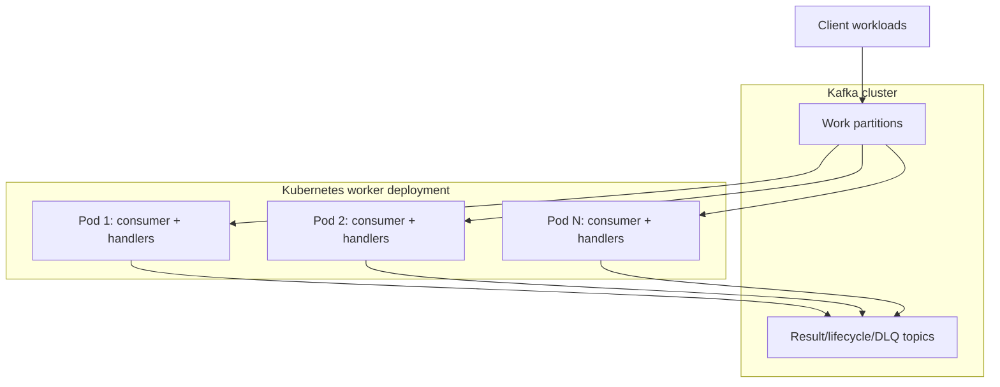

# Kafka Pull-Based Job Scheduler Architecture

Status: proposed for review

Last updated: 2026-09-06

Governing specification: [`spec.md`](spec.md)

This document follows arc42 and uses C4-style diagrams. It describes the target Kafka-only
execution architecture for Spec 006.

## Contents

- [1. Introduction and Goals](#1-introduction-and-goals)
- [2. Architecture Constraints](#2-architecture-constraints)
- [3. Context and Scope](#3-context-and-scope)
- [4. Solution Strategy](#4-solution-strategy)
- [5. Building-Block View](#5-building-block-view)
- [6. Runtime View](#6-runtime-view)
- [7. Deployment View](#7-deployment-view)
- [8. Cross-Cutting Concepts](#8-cross-cutting-concepts)
- [9. Architecture Decisions](#9-architecture-decisions)
- [10. Quality Requirements](#10-quality-requirements)
- [11. Risks and Technical Debt](#11-risks-and-technical-debt)
- [12. Glossary](#12-glossary)

## 1. Introduction and Goals

### 1.1 Purpose

Clients submit immediately executable jobs directly to Kafka. A horizontally scaled worker
group pulls those requests, limits starts per pod, applies backpressure during downstream
publication failure, and explicitly advances source offsets only after a safe durable
boundary. The scheduler database, database poller, due-job dispatcher, and work outbox are
not part of this runtime.

### 1.2 Architecture goals

| Priority | Goal | Architectural response |
| ---: | --- | --- |
| 1 | No acknowledged request is lost | Kafka acknowledgement is submission acknowledgement; offsets advance only at safe boundaries. |
| 2 | Owner serialization and offset safety | Stable `ownerId` partitioning, keyed execution, and transactional Kafka outputs/offsets. |
| 3 | Bounded dependency load | Per-pod token bucket plus bounded concurrency and queues. |
| 4 | Failure backpressure | Assigned partitions pause while required Kafka writes fail; polling continues for heartbeats. |
| 5 | Durable failure handling | Permanent/exhausted requests reach a dedicated DLQ before source commit. |
| 6 | Horizontal scaling | One consumer group distributes partitions across worker pods. |
| 7 | Explainable operation | Lag, offset, throttling, pause state, retries, and DLQ activity are observable. |

### 1.3 Stakeholders

| Stakeholder | Concern |
| --- | --- |
| Client teams | How to publish safely, interpret acknowledgement, and correlate results. |
| Platform engineers | Topic capacity, credentials, quotas, rebalances, and transactions. |
| Worker owners | At-least-once handling, rate limits, concurrency, and shutdown. |
| Operations | Backlog, pauses, DLQ recovery, replay, and hot partitions. |
| Audit/support | Immutable request, outcome, lifecycle, and failure evidence. |
| Security | Direct client access, payload governance, and replay permissions. |

## 2. Architecture Constraints

### 2.1 Functional constraints

- Spec 006 requests are eligible immediately when published.
- The client supplies immutable `jobId`, `ownerId`, and `ownerType`; `ownerId` is the Kafka key.
- All workers for a logical workload share one consumer group.
- Auto-commit is disabled.
- Success, retry, and DLQ source offsets advance only after their required durable outputs.
- The TPS limit applies independently to each pod, not globally to the fleet.
- Lifecycle EDR and visibility semantics from earlier specifications remain authoritative.

### 2.2 Technology constraints

- Kafka is the durable operational queue and source of execution truth.
- `job-requests.v1`, `job-results.v1`, `job-lifecycle-edr.v1`, and
  `job-requests-dlq.v1` are distinct topic contracts.
- Kafka producer idempotence is enabled; transactional producers are used to couple output
  records and consumed offsets.
- Transactional consumers use `read_committed` isolation.
- Schemas are registered and compatibility checked before rollout.
- Worker concurrency, queues, timeouts, retries, and shutdown are finite.

### 2.3 Consequences of removing the scheduler database

- There is no native future scheduling or delayed retry. A separate timer service would be
  required and is outside Spec 006.
- Status, search, audit, and attempts are derived from Kafka lifecycle/result projections.
- Producer idempotence does not deduplicate a retry from a new producer session.
- Kafka cannot atomically include an arbitrary external business side effect; duplicate
  execution is accepted until a future deduplication/idempotency specification.
- Cancellation requires a separately designed command and race policy.

## 3. Context and Scope

### 3.1 C4 level 1 — system context

### 3.2 System boundary

Inside the solution boundary are topic/schema contracts, shared producer library or
optional stateless submission API, worker runtime, handler registry, rate limiter,
backpressure controller, offset coordinator, transactional output
publisher, metrics, health, and DLQ tooling.

Managed Kafka, Schema Registry, identity/secret systems, business dependencies, visibility
storage, and monitoring backends may be externally operated. Their interfaces and required
configuration remain architecture contracts.

### 3.3 External interfaces

| Interface | Direction | Consistency | Purpose |
| --- | --- | --- | --- |
| `job-requests.v1` | Inbound | Broker-acknowledged, at least once | Immediately eligible commands. |
| Business handler | Outbound | At least once | Perform work that may be repeated after ambiguity. |
| `job-results.v1` | Outbound | Transactional with source offset | Immutable attempt/result evidence. |
| `job-lifecycle-edr.v1` | Outbound | Transactional with source offset | Visibility lifecycle evidence. |
| `job-requests-dlq.v1` | Outbound | Transactional with source offset | Quarantined permanent/exhausted work. |
| Health/metrics/traces | Outbound | Near real time | Operability and diagnosis. |

## 4. Solution Strategy

1. A client validates and publishes a versioned command keyed by canonical `ownerId` with
   idempotent production.
2. Kafka acknowledges durable submission; execution remains asynchronous.
3. A group assigns each partition to one worker pod.
4. The pod polls bounded batches and dispatches only when queue, concurrency, TPS, and
   backpressure gates permit.
5. A keyed execution gate permits at most one active job per `ownerId` in a pod.
6. The handler performs its side effect with documented at-least-once semantics.
7. The worker transactionally writes result/lifecycle/retry/DLQ records and source offsets.
8. Publication failure pauses affected work while heartbeat polls preserve membership.

The design provides Kafka exactly-once processing for Kafka records when transactions are
enabled, but only at-least-once end-to-end execution because external side effects are not
inside the Kafka transaction.

## 5. Building-Block View

### 5.1 C4 level 2 — containers

### 5.2 Worker components

## 6. Runtime View

### 6.1 Successful request

### 6.2 Required publication failure

### 6.3 Permanent failure

The worker classifies the record, begins a Kafka transaction, publishes terminal result,
lifecycle, and DLQ envelopes, adds the source offset, and commits. Any failure aborts the
transaction, leaves the source offset unchanged, and activates backpressure. A crash after
an external side effect but before commit causes redelivery and may repeat that effect.

### 6.4 Rebalance and shutdown

Revocation stops dispatch for affected partitions. The pod drains only to a bounded
deadline and commits the highest contiguous safe offset; unfinished work is abandoned for
redelivery. Shutdown first fails readiness, then follows the same bounded drain path.

Kafka assigns a partition to at most one consumer in the same `group.id` during stable
operation. During reassignment, however, the former pod may still have an external call in
flight after the new pod receives the partition. Offset ownership alone cannot cancel that
call, so generation fencing protects Kafka writes but does not prevent a duplicate external
effect.

## 7. Deployment View

Maximum active parallelism is bounded by partition count. Each pod has a unique consumer
instance and transactional producer identity. Rolling updates use readiness and sufficient
termination grace. Autoscaling uses lag/age but caps replicas and therefore aggregate TPS.

## 8. Cross-Cutting Concepts

### 8.1 Delivery and transactions

Auto-commit is disabled. Output records and consumed offsets use Kafka transactions and
`read_committed` readers. Concurrent partition processing advances only through contiguous
completed offsets. Transactional IDs are unique and fenced across pod generations.

Two pods using different Kafka `group.id` values are independent subscribers and will each
process every partition. All replicas of one worker fleet must use the same `group.id`.
Within that group, only the current assignment generation may publish results or advance
offsets. For completed offsets `100` and `102` with `101` still running, the highest safe
commit is `101`; committing `103` is forbidden because it would skip offset `101`.

### 8.2 Owner affinity and duplicate semantics

`ownerId` is a canonical subscriber or business-group identifier and is the serialized
Kafka key. `ownerType` declares whether it represents `SUBSCRIBER` or `GROUP`. All producers
use identical normalization/serialization, never set a null key or explicit partition, and
preserve the original key for retries and DLQ replay. Partition count remains fixed after
cutover unless an ordering-impact migration is approved.

The owner-selection rule is stable per workload: subscriber serialization always uses the
subscriber owner, while group serialization always uses the business-group owner. Mixing
those scopes cannot guarantee subscriber affinity. Canonical keys include a namespace such
as `subscriber:123` or `group:123`. The Kafka consumer `group.id` names a worker fleet and
has no relationship to a business group owner.

Partition affinity does not itself prevent concurrent dispatch inside a worker. A per-owner
gate permits at most one active job for each `ownerId`; different owners sharing a partition
may execute concurrently behind contiguous offset tracking. There is no durable
`(jobId, attempt)` lookup in Spec 006. Redelivery or resubmission may repeat execution and
produce duplicate results; durable deduplication and conflict handling are deferred.

### 8.3 Backpressure and rate limiting

A token bucket gates handler starts per pod. Capacity exhaustion or Kafka output failure
pauses partitions without stopping heartbeat polls. Recovery uses bounded jittered probes.
Readiness and liveness distinguish sustained inability to process from a dead process.

### 8.4 Security

Clients have write-only work-topic access. Workers read their group, write named output
topics, and own only their transactional IDs. DLQ read/replay is separately privileged and
audited. Schemas, payload size, quotas, encryption, and redaction are centrally enforced.

### 8.5 Observability

Correlation includes `jobId`, attempt, topic, partition, offset, transaction, and worker
identity. Metrics cover lag/age, assignments, pauses, TPS waits, concurrency, transaction
aborts, retries, DLQ, rebalances, and repeated job/attempt observations.

## 9. Architecture Decisions

| ID | Decision | Rationale | Consequence |
| --- | --- | --- | --- |
| ADR-006-01 | Kafka replaces the scheduler database in the new path. | Removes database polling and makes the queue the pull boundary. | No database queries for operational job state. |
| ADR-006-02 | Only immediately eligible jobs are accepted. | Kafka partitions are not delayed queues. | Future scheduling needs another service. |
| ADR-006-03 | Kafka key is canonical `ownerId`, representing a subscriber or business group. | Keeps every owner's jobs in one partition. | Large owners can cause skew and head-of-line blocking. |
| ADR-006-04 | One consumer group represents one worker fleet. | Kafka distributes partition ownership. | Replicas beyond partitions are idle. |
| ADR-006-05 | TPS is enforced per pod with a token bucket. | Simple and locally enforceable. | Fleet TPS changes with replica count. |
| ADR-006-06 | Required publication failure pauses partitions. | Prevents consuming work whose outcome cannot be made durable. | Lag grows visibly during outage. |
| ADR-006-07 | Kafka transactions couple outputs and source offsets. | Avoids partial Kafka handoffs. | Unique transactional IDs and `read_committed` are required. |
| ADR-006-08 | End-to-end semantics remain at least once. | External side effects cannot join Kafka transactions. | Duplicate execution is accepted and must be observable. |
| ADR-006-09 | Durable job deduplication is deferred. | Keep Spec 006 focused on pull delivery, flow control, and offset safety. | A later spec must define storage, TTL/retention, conflicts, and external idempotency. |

## 10. Quality Requirements

| Scenario | Required response |
| --- | --- |
| Broker acknowledges submission | Request survives client exit and is eventually assigned within retention/SLO bounds. |
| Output Kafka write fails | No source commit; pod pauses new work and continues heartbeat polls. |
| Pod dies after side effect | Request redelivers; any duplicate execution is measured and reported. |
| Pod exceeds TPS demand | Starts remain within configured rate/burst; lag grows rather than dependency load. |
| Permanent poison record | DLQ/result/lifecycle and source offset commit atomically. |
| Rebalance during concurrent work | No offset advances over unfinished earlier work. |
| Former pod completes after revocation | Its stale Kafka transaction is fenced; redelivery may repeat the external effect. |
| Two pods use different consumer groups | Validation/deployment policy detects the split fleet before both can process production work. |
| Offsets 100 and 102 complete while 101 runs | Commit advances only to 101, never 103. |
| New producer session resubmits | Both records may execute; metrics expose the repeated `(jobId, attempt)`. |
| Two jobs for one owner are fetched together | Per-owner gate allows only one active handler for that `ownerId`. |
| 20,000 requests arrive over ten minutes | Three baseline pods cap starts near 30/second; excess is visible as lag and later drains. |
| One owner produces 50% of a burst | Its jobs remain serialized and skew is measurable without corrupting other partitions. |
| One of three pods dies during a burst | Kafka reassigns partitions; duplicates are measured and surviving pods retain their TPS limits. |
| 20,000 requests arrive in one minute | Kafka retains intake while bounded pod queues avoid memory growth; recovery duration is measured. |

### 10.1 Capacity and chaos baseline

The initial hypothesis is six work partitions and three pods, each configured for 10
sustained starts/second, burst 10, concurrency 20, and one active handler per `ownerId`.
The expected aggregate start ceiling is approximately 30/second, subject to owner skew,
handler duration, and partition assignment. Daily volume of 20,000 requests is only 0.23
requests/second on average and is not itself a sufficient sizing input.

Capacity evidence exercises 24-hour-equivalent, one-hour, ten-minute, and one-minute
arrival curves. Chaos is overlaid with a 50% hot owner, single-pod termination, output-topic
failure/backpressure, and repeated rebalances. Each experiment proves owner non-overlap,
offset safety, bounded memory/queues, per-pod TPS, observable lag, and bounded backlog drain.
Six partitions remain a proposal until these tests meet the agreed objectives; twelve must
be evaluated if six cannot absorb realistic peak and recovery demand.

## 11. Risks and Technical Debt

| Risk | Impact | Mitigation |
| --- | --- | --- |
| External side effect is not transactional with Kafka | Duplicate physical calls | Accepted in Spec 006, measured in fault tests, resolved by the next spec. |
| Direct Kafka access expands client responsibility | Schema/security/configuration drift | Shared producer SDK or stateless submission API. |
| Large owners or too few partitions | Low throughput and head-of-line blocking | Per-owner volume tests, skew metrics, fixed reviewed partition strategy. |
| Retry is immediate | Dependency amplification | TPS gate, attempt limit, backpressure; add timer service only by new design. |
| Transaction misconfiguration | Duplicated/hidden outputs | Startup validation, unique IDs, `read_committed`, integration tests. |
| No operational job table | Query/cancel behavior is eventually consistent | Result/lifecycle projections and separate cancellation contract. |

## 12. Glossary

| Term | Meaning |
| --- | --- |
| Safe offset | Next Kafka offset after a contiguous set whose required durable work is complete. |
| Backpressure | Pausing dispatch while retaining records and consumer membership. |
| Immediate retry | A new attempt published without a scheduled delay. |
| DLQ | Kafka topic containing permanent or exhausted failures plus source coordinates. |
| Duplicate execution | A repeated handler invocation for the same `(jobId, attempt)`, permitted by Spec 006. |
| `ownerId` | Canonical Kafka key identifying the subscriber or business group whose jobs must not overlap. |
| `ownerType` | Metadata declaring whether `ownerId` represents `SUBSCRIBER` or `GROUP`. |
