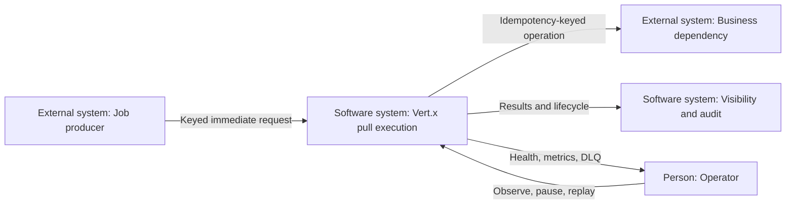
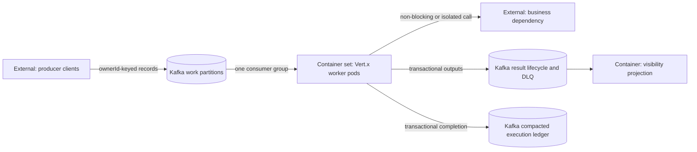
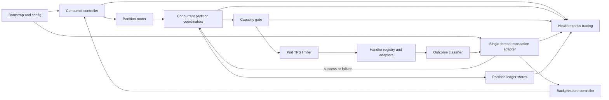
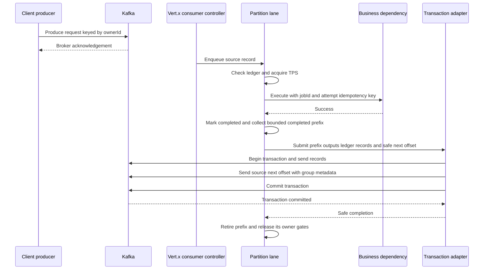
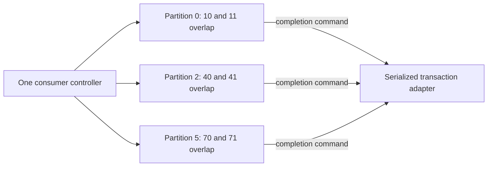
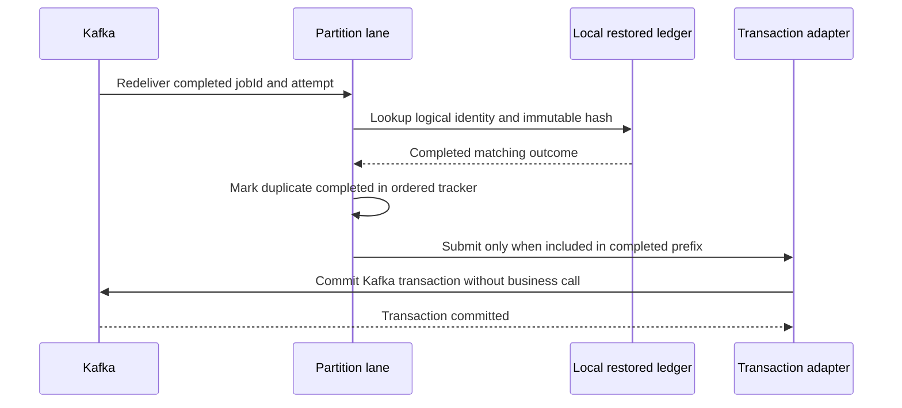
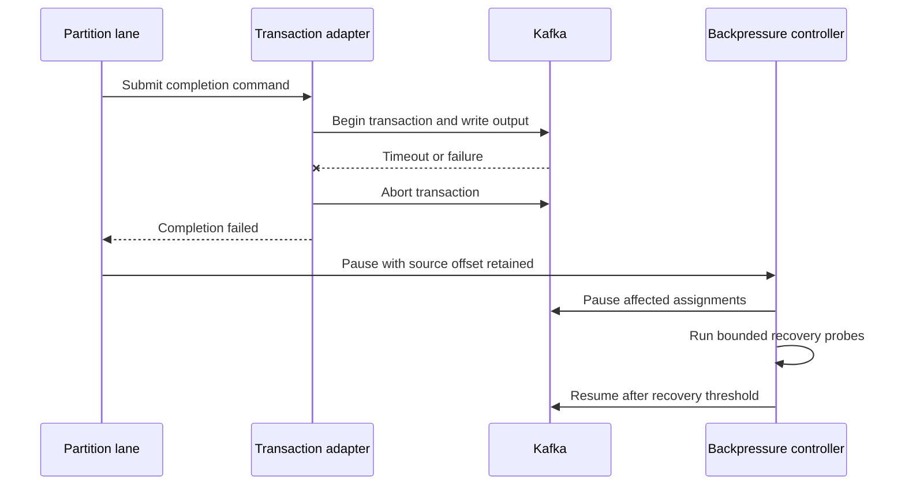
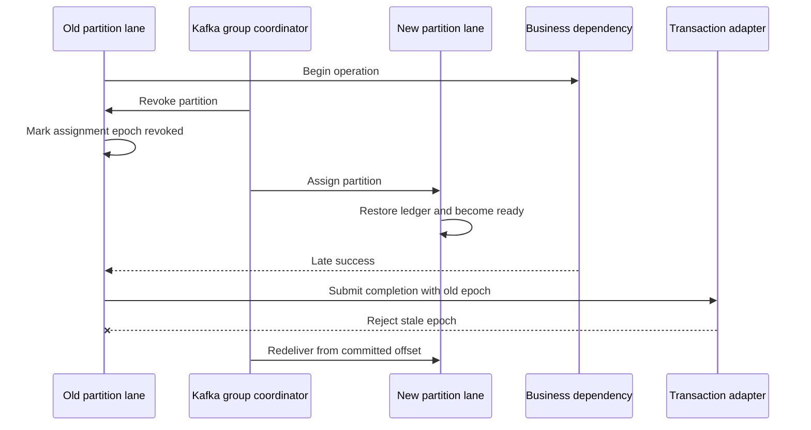
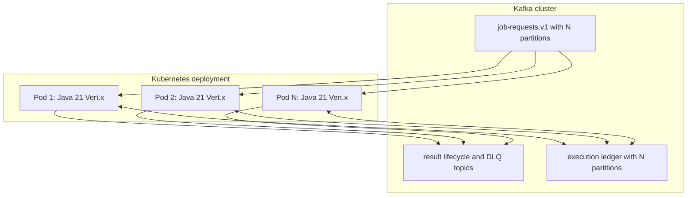

# Vert.x Kafka Pull Worker Architecture

Status: proposed for review

Last updated: 2026-09-07

Governing specification: [`spec.md`](spec.md)

This arc42 document is the target production architecture for the Kafka pull worker. It
supersedes the Python worker architecture in Spec 006 while retaining Spec 006 topic and
producer contracts.

## Contents

- [1. Introduction and Goals](#1-introduction-and-goals)
- [2. Architecture Constraints](#2-architecture-constraints)
- [3. Context and Scope](#3-context-and-scope)
- [4. Solution Strategy](#4-solution-strategy)
- [5. Building-Block View](#5-building-block-view)
- [6. Runtime View](#6-runtime-view)
- [7. Deployment View](#7-deployment-view)
- [8. Cross-Cutting Concepts](#8-cross-cutting-concepts)
- [9. Architecture Decisions](#9-architecture-decisions)
- [10. Quality Requirements](#10-quality-requirements)
- [11. Risks and Technical Debt](#11-risks-and-technical-debt)
- [12. Glossary](#12-glossary)

## 1. Introduction and Goals

### 1.1 Purpose

Clients publish immediately executable jobs directly to Kafka using canonical `ownerId` as
the record key. Vert.x worker pods consume the topic, run bounded concurrent work within and across partitions,
serialize records for each owner, limit starts per pod, and commit required
Kafka outcomes with exact source offsets.

The scheduler database remains removed. Kafka contains the work, durable outcomes,
lifecycle evidence, failure quarantine, completed-request ledger, and consumer offsets.

### 1.2 Architecture goals

| Priority | Goal | Architectural response |
| ---: | --- | --- |
| 1 | Offset correctness | Contiguous-completion tracker and atomic prefix transactions per partition. |
| 2 | Owner serialization | Canonical `ownerId` key and FIFO owner gates held through commit. |
| 3 | Reactive responsiveness | Event-loop-confined control state and no blocking event-loop calls. |
| 4 | Useful concurrency | Multiple owners in one assigned partition execute concurrently. |
| 5 | Bounded load | Pod-wide token bucket, lane queues, worker executor, and pause/resume. |
| 6 | Atomic Kafka completion | Required outputs, ledger record, and source offset use one transaction. |
| 7 | Completed duplicate suppression | Kafka-backed partition-local ledger restored before readiness. |
| 8 | Safe ownership transfer | Assignment epochs reject late completions after revocation. |
| 9 | Operability | Lane, event-loop, executor, transaction, lag, and ledger state are observable. |

### 1.3 Stakeholders

| Stakeholder | Concern |
| --- | --- |
| Client teams | Existing topic/key/schema compatibility and acknowledgement semantics. |
| Worker developers | Vert.x threading, lane ordering, handler APIs, and failure classification. |
| Kafka platform | Groups, transactions, partition capacity, ACLs, and ledger compaction. |
| Operations | Lag, pauses, blocked loops, restores, rebalances, and rollback. |
| Business dependency owners | TPS limits, idempotency keys, deadlines, and duplicate effects. |
| Security | Direct Kafka access, least privilege, payload controls, and DLQ access. |

## 2. Architecture Constraints

### 2.1 Functional constraints

- Requests are eligible immediately and are keyed by canonical `ownerId`.
- `ownerId` represents either `subscriber:<id>` or `group:<id>` as declared by `ownerType`.
- All production replicas use one consumer group.
- Each assigned partition processes bounded concurrent records for different owners.
- Different assigned partitions may process concurrently.
- Auto commit is disabled and fetched positions are never treated as processed offsets.
- Required result/lifecycle/retry/DLQ records precede or share the source commit boundary.
- Each pod has one shared TPS limiter.
- Output failure stops new starts and retains uncommitted records.
- A completed logical request is suppressed within the deduplication retention window.

### 2.2 Technology constraints

- Java 21 is the runtime baseline.
- A supported Vert.x 5 release is pinned through the Vert.x BOM.
- Maven builds and tests the service reproducibly.
- Vert.x Core, Kafka Client, Web, Config, Micrometer, and JUnit 5 integrations are used
  where applicable.
- The underlying Apache Kafka producer is isolated behind a transaction adapter for
  `sendOffsetsToTransaction`.
- Kafka transaction operations run on a dedicated single-thread executor.
- Blocking handlers run on a separate bounded executor and never on an event loop.
- Production images run as non-root and contain no Python or scheduler DB client.

### 2.3 Delivery constraints

Kafka transactions provide atomic visibility for Kafka outputs and source offsets. An
arbitrary external side effect cannot participate in that transaction. The end-to-end
guarantee therefore remains at least once across ambiguous external-call failures.

Completed deduplication narrows, but does not eliminate, this window. Business handlers
must propagate `(jobId, attempt)` as an idempotency key whenever the dependency supports it.

## 3. Context and Scope

### 3.1 System context

### 3.2 System boundary

Inside the Vert.x worker boundary are configuration validation, Kafka consumer control,
partition lanes, queue/capacity controls, the TPS limiter, handler registry, business
adapters, outcome classification, transaction coordination, ledger restoration, health,
metrics, and tracing.

Kafka, Schema Registry, business dependencies, secret/identity systems, monitoring, and
visibility projections remain external systems. The Python simulator and Spec 006 worker
are migration/reference systems, not production peers after cutover.

### 3.3 External interfaces

| Interface | Direction | Consistency | Purpose |
| --- | --- | --- | --- |
| `job-requests.v1` | Inbound | Broker-acknowledged, at least once | Immediately eligible work. |
| Business handler | Outbound | At least once | Perform the requested effect. |
| `job-results.v1` | Outbound | Transactional with source offset | Immutable attempt outcome. |
| `job-lifecycle-edr.v1` | Outbound | Transactional with source offset | Lifecycle evidence. |
| `job-requests-dlq.v1` | Outbound | Transactional with source offset | Permanent/exhausted failures. |
| `job-execution-ledger.v1` | Internal | Transactional, compacted | Completed duplicate authority. |
| `/health/live`, `/health/ready`, `/metrics` | Outbound | Near real time | Platform and operator status. |

## 4. Solution Strategy

1. Keep Spec 006's work, result, lifecycle, retry, DLQ, and `ownerId` contracts.
2. Replace the production Python worker with one Vert.x service per pod.
3. Confine Kafka consumer control and mutable lane state to Vert.x contexts.
4. Register each record in an ordered tracker identified by topic and partition.
5. Dispatch different owners within and across partitions under pod/partition limits.
6. Prefer non-blocking handlers; isolate unavoidable blocking work in a bounded executor.
7. Serialize Kafka transactions on a dedicated adapter outside the event loop.
8. Atomically publish required outcomes, ledger updates, and exact source offsets.
9. Pause partitions at bounded queue watermarks or failure boundaries.
10. Restore the ledger for an assignment before advertising readiness.

This structure keeps partition counts low by separating handler concurrency from assignment
count. Same-owner FIFO preserves the existing ordering contract; a contiguous tracker
prevents out-of-order completion from acknowledging unfinished work.

## 5. Building-Block View

### 5.1 Containers

### 5.2 Vert.x worker components

### 5.3 Component responsibilities

| Component | Responsibility | Threading rule |
| --- | --- | --- |
| Bootstrap | Validate config/topics and construct dependencies. | Startup context; bounded async calls. |
| Consumer controller | Subscription, assignment, pause/resume, close. | One context-owned actor. |
| Partition router | Route records and enforce bounded queues. | Consumer context. |
| Partition lane | Track delivery order, owner gates, and concurrent outcomes. | Context-confined; bounded active jobs. |
| TPS limiter | Grant pod-wide start permits using monotonic time. | Context-confined timers. |
| Async handler | Invoke non-blocking Vert.x clients. | Event loop, never blocking. |
| Blocking adapter | Bridge legacy blocking handler. | Dedicated bounded worker executor. |
| Transaction adapter | Produce outputs and send exact group offsets. | Dedicated single thread; no overlap. |
| Ledger store | Restore and query completed identities per partition. | Lane/context-owned access. |
| Backpressure | Decide pause, probe, resume, readiness. | Context-confined state machine. |

## 6. Runtime View

### 6.1 Successful request

### 6.2 Concurrency within and across partitions

All six offsets may execute simultaneously when their owners differ and capacity permits.
Within each partition, only a completed prefix can commit. Same-owner records wait for
the preceding owner record to commit. Completed outcomes behind a gap consume bounded
tracking-window capacity even after their handlers release execution permits.

### 6.3 Completed duplicate

### 6.4 Required-output failure

### 6.5 Rebalance during external execution

The stale lane cannot commit Kafka state. The business dependency may already have applied
the first call; its idempotency key is the only way to prevent a repeated physical effect.

## 7. Deployment View

One pod can run up to `min(maxInFlightPerPod, assignedPartitions * maxInFlightPerPartition)`
handlers, subject to distinct eligible owners, executor capacity, and TPS. One partition
can support eight concurrent handlers when the configured limits permit it. With six partitions and more than six pods, extra pods have no work assignment.
Stable worker-slot identities, such as StatefulSet ordinals, form transactional IDs. A
replacement reuses the slot ID to fence a zombie predecessor; separate live slots never
share one.

Scaling to 100,000 requests/day is driven by peak rate, handler duration, owner skew, and
recovery objective rather than the daily average. Tune within-partition concurrency and pod resources at fixed low partition counts first;
add pods up to the existing partition count when justified by measured capacity. Increase partitions only through an ordering-aware migration because the
`ownerId` hash mapping changes for newly produced records. The ledger topic must expand in
lockstep, and cutover must prevent one owner from overlapping old and new mappings.

## 8. Cross-Cutting Concepts

### 8.1 Threading and reactive execution

Event loops own control-plane state and compose asynchronous Futures. Blocking work is
explicitly isolated. `executeBlocking(..., ordered=false)` is used behind a named bounded
executor when required because explicit owner gates establish same-owner order. Event-loop delay
and executor saturation are release metrics, not merely debug logs.

### 8.2 Offset safety

The service never calls no-argument `consumer.commit()` for work completion. It constructs
an exact map from bounded contiguous completed prefixes. With 100/101 completed, 102
running, 103/104 completed, and 105 queued, commit 102. When 102 completes, atomically
commit outputs for 102–104 and next offset 105. Committing changes the recovery position,
not the current fetch position. Contiguity is over registered delivered records, since
Kafka offsets may have broker-level gaps. Never use the highest completed or fetched offset.

Only confirmed commit success retires a prefix. One prefix per partition may be outstanding;
snapshot commands cannot change while queued. Ambiguous commits require broker offset and
ledger recovery before replay, with old execution tokens invalidated. See spec sections 4–7.

### 8.3 Transaction ownership

The transaction adapter is a serial actor backed by one dedicated thread. It is the sole
owner of transaction lifecycle operations. It receives immutable completion commands,
checks assignment epochs, writes all required Kafka records, sends offsets with consumer
group metadata, and reports a Future back to the lane context.

The adapter's queue is bounded. Saturation backpressures lane dispatch. Transactional IDs
are unique by environment, workload, and stable worker slot. The replacement for a slot
reuses its ID during transaction initialization, fencing a stale producer from that slot.

### 8.4 Deduplication

Completed ledger records contain logical identity, immutable request hash, outcome
reference, completion time, source coordinates, and expiry time. They are written in the
same Kafka transaction as the logical result and source offset.

Ledger partitions mirror work partitions. Assignment restoration reads to a captured end
offset before the lane becomes ready. Compaction bounds historical keys; an explicit
tombstone process applies business retention. A two-hour TTL is valid only when the entire
redelivery and support window is shorter than two hours.

### 8.5 Backpressure and capacity

Per-partition and pod record/byte watermarks cover queued, running, completed, and committing
entries. Reserve client-buffer headroom and allow admitted work to close the earliest gap.
A completed outcome behind a gap retains window capacity; handler capacity is separate. The pod TPS token bucket protects the
business dependency. The transaction-adapter queue protects Kafka/JVM resources. Any gate
can pause affected partitions without committing records merely because they were fetched.

### 8.6 Security

Clients can write only the request topic. Workers can read only the configured group and
write named result/lifecycle/retry/DLQ/ledger topics. Only the worker transactional-ID
prefix is authorized. DLQ and replay are separately privileged. Payload logging is denied
by default.

### 8.7 Observability

OpenTelemetry context is propagated through Future chains and worker-executor boundaries.
Micrometer exposes Vert.x/JVM, custom lane, TPS, Kafka, transaction, ledger, and business
adapter metrics. Cardinality is bounded: raw `jobId` and `ownerId` are trace/log fields, not
metric labels.

## 9. Architecture Decisions

| ID | Decision | Rationale | Consequence |
| --- | --- | --- | --- |
| ADR-007-01 | Production pull workers use Java 21 and Vert.x 5. | Matches the target reactive microservice platform. | A separate Maven module and image replace the Python worker. |
| ADR-007-02 | One consumer controller exists per pod. | Keeps group membership and assignment state coherent. | Handler concurrency comes from bounded dispatch within assigned partitions. |
| ADR-007-03 | Bounded concurrent records are allowed per partition. | Keep partition counts low while using handler capacity. | Owner gates and contiguous trackers are required. |
| ADR-007-04 | Dispatch within and across partitions. | Use available capacity despite slow unrelated owners. | Explicit partition/pod limits bound handler concurrency. |
| ADR-007-05 | Event loops never run blocking handlers or Kafka transaction calls. | Preserves consumer and health responsiveness. | Bounded dedicated executors are required. |
| ADR-007-06 | No-argument consumer commit is forbidden. | It may acknowledge fetched but unfinished records. | Exact offset maps are always constructed. |
| ADR-007-07 | Kafka transaction lifecycle is serialized in one adapter. | Producer transactions cannot overlap and Vert.x lacks the required high-level offset API. | Transaction throughput is measured as a potential bottleneck. |
| ADR-007-08 | One bounded completed prefix uses one transaction initially. | Couple every prefix output with its safe next offset. | Retain outcomes behind gaps; cross-partition batching is deferred. |
| ADR-007-09 | Completed deduplication uses a compacted Kafka ledger plus local restored stores. | Avoids reintroducing a scheduler database or relying on ephemeral caches. | Assignment readiness waits for restore. |
| ADR-007-10 | Dedup retention follows the recovery/replay window, not an arbitrary TTL. | A short TTL silently reopens duplicate execution. | Cleanup requires governed tombstones. |
| ADR-007-11 | External operations receive `(jobId, attempt)` idempotency keys. | Kafka cannot atomically commit an external side effect. | Dependencies unable to honor the key retain at-least-once effects. |
| ADR-007-12 | Python remains a test oracle during migration only. | Enables differential validation without dual production processing. | Cutover must enforce mutually exclusive consumers. |

## 10. Quality Requirements

| Scenario | Required response |
| --- | --- |
| Pod owns three partitions | Multiple handlers per partition overlap within pod/partition capacity. |
| Four records are fetched from one partition | Different owners overlap; commits stop before the earliest unfinished delivered record. |
| Execution verticle fails at 102 after 100/101/103/104 finish | Commit only through 101 (next offset 102); supervise failed execution, retain later outcomes, and resolve or replay 102 before advancing (`VTX-OFF-05`). |
| TPS capacity is exhausted | Lanes wait on timers without occupying worker/event-loop threads. |
| Output Kafka fails | Transaction aborts, offset remains unchanged, queues stay bounded, and intake pauses. |
| One blocking handler stalls | Event loop, health, Kafka control, and other lanes remain responsive. |
| Partition is revoked mid-call | Old epoch cannot commit; unfinished offset redelivers. |
| Completed request redelivers | Ledger suppresses the handler inside retention. |
| New pod receives a partition | It restores ledger state before readiness and dispatch. |
| Immutable duplicate conflicts | It is quarantined and does not reuse a prior success. |
| One owner carries half of traffic | Owner remains serial; skew and head-of-line delay are visible. |
| Volume rises to 100,000/day | Tune concurrency and resources at low fixed partition counts; expansion requires evidence and controlled remapping. |
| Transaction adapter saturates | Its bounded queue pauses lanes and emits saturation metrics. |

## 11. Risks and Technical Debt

| Risk | Impact | Mitigation |
| --- | --- | --- |
| Transaction adapter becomes bottleneck | Handler concurrency does not translate into completion throughput. | Benchmark bounded prefix batches and transaction queue saturation. |
| Incorrect native-client threading | Event-loop stalls or unsafe consumer metadata access. | Encapsulated adapter, thread-affinity tests, no general `unwrap()` usage. |
| Vert.x pause has buffered records | Queue temporarily receives records after pause. | Size for `max.poll.records`, enforce bounded router, test high-water behavior. |
| Ledger restore delays readiness | Rebalance recovery takes longer. | Partitioned restore, restore metrics, retention/compaction tuning. |
| Ledger TTL is too short | Old duplicate executes again. | Tie retention to declared recovery/replay window and alert before expiry. |
| External effect is ambiguous at crash | Physical duplicate remains possible. | Dependency idempotency key, explicit metrics, chaos proof. |
| Hot owner blocks commit progress | Later owners can execute, but completed outcomes accumulate behind gaps. | Bound tracking memory and gap age; maintain same-owner FIFO. |
| Partition expansion remaps owners | Old and new owner jobs may overlap. | Quiesce/drain or versioned-topic migration with owner fencing. |

## 12. Glossary

| Term | Meaning |
| --- | --- |
| Partition lane | Context-owned coordinator for concurrent records, owner gates, and completion tracking. |
| Consumer controller | Context-owned Vert.x component controlling subscription and assignments. |
| Exact next offset | One past the last record in an included contiguous completed prefix. |
| Transaction adapter | Single-thread component coupling Kafka outputs and consumed offsets. |
| Assignment epoch | Local generation token invalidated when a partition is revoked. |
| Completed ledger | Kafka-backed record of a completed logical `(jobId, attempt)`. |
| Restore | Catching a partition-local ledger store up before processing assigned work. |
| Safe boundary | Point where required Kafka outputs and source next offset are atomically durable. |
